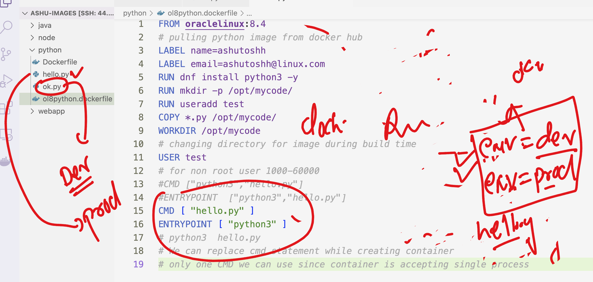

## docker images inspect search 

### docker inspect ---  {} filter particular output like cpu arch and os kernel details 

```
[test@docker-server ~]$ docker  inspect  05455a08881e
[
    {
        "Id": "sha256:05455a08881ea9cf0e752bc48e61bbd71a34c029bb13df01e40e3e70e0d007bd",
        "RepoTags": [
            "alpine:latest"

```

###  change content of a.txt and remote b.txt but not using docker cli 

```
[root@docker-server ~]# 
[root@docker-server ~]# docker  exec -it  ashuc1 sh 
/ # 
/ # 
/ # ls
bin    dev    etc    home   lib    media  mnt    opt    proc   root   run    sbin   srv    sys    tmp    usr    var
/ # cd /opt/
/opt # ls
/opt # mkdir hello 
/opt # touch a.txt b.txt
/opt # echo hello>a.txt 
/opt # pwd
/opt
/opt # ls
a.txt  b.txt  hello
/opt # cat a.txt 
hello
/opt # 


```


## Docker Installation -- 

###  docker-ce 23 version 

<ol> 
     <li> amazon linux 2 / 3 </li>
    <li> Ubuntu (min version 20, or later )</li>
    <li> RHEL (min version 7 or later ) </li>
     <li> Windows 10 or later -- use Docker Desktop / Rancher Desktop  </li>
      <li> MAC -- use Docker Desktop / Rancher Desktop </li>

</ol>

### Limit Resource task 

```
1. create container with limited RAM amount of 100M  and cpu 20% of first core 
2. after creation update the limit to 200M
3. after creation update cpu to 30% of same core 
```

## CUstom docker image with given instructions 

<li> choose any base image to build docker image </li>
<li> use hello.py as python code --take code from docker day5 directory   </li>
<li> make sure python version must be 3.11  </li>
<li> try to keep image size in the range of 50 to 70 MB  </li>
<li> try to take base image based on debian , ubuntu , alpine , redhat  </li>
<li> create container and check output  </li>


## Answer for testing 

```
testing
```

### Dockerfile ENV task 


