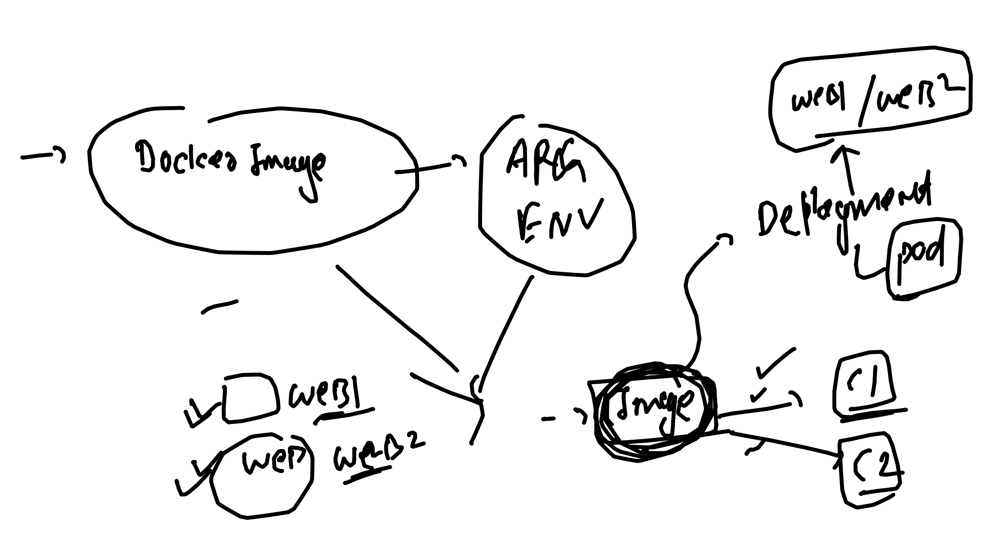

# devops_mastering

### RC 

<ol>
    <li> problem with RC </li>
    <li> implement that problem just to verify </li>
</ol>

### Task 1 -- for deployment controller 



### Task 2 -- POd related

```
  1. Create pod named  <yourname>pod1
  2. In POd docker image will be busybox 
  3. choose ping fb.com as default process
  4. check output of default process and store in a file  called logs.txt in client machine 
  5. now transfer logs.txt on your pods under /opt/logs.txt 
  6. check that pods is scheduled in which minion node and store that name in logs.txt inside pod 
  7. make sure previous data in logs.txt must be present 
  
  
```

### task -3 -- Converting compose to k8s manifest

```
wordpress:
    image: wordpress
    restart: always
    ports:
      - 8080:80
    environment:
      WORDPRESS_DB_HOST: db
      WORDPRESS_DB_USER: exampleuser
      WORDPRESS_DB_PASSWORD: examplepass
      WORDPRESS_DB_NAME: exampledb
    volumes:
      - wordpress:/var/www/html

  db:
    image: mysql:8.0
    restart: always
    environment:
      MYSQL_DATABASE: exampledb
      MYSQL_USER: exampleuser
      MYSQL_PASSWORD: examplepass
      MYSQL_RANDOM_ROOT_PASSWORD: '1'
```

## Task 4 -- 
- Deploy adminer with mysql | postgresSQL | mongo | mssql using compose

### task 5 -- 
- Deploy - adminer + mysql in Rancher Desktop (k8s manifest)

### task 6 -- 

- adminer +  mysql + mongo in Rancher Desktop  (k8s manifest)

### task 7 
- use nginx helm package to deploy application using helm only with following conditions
- make sure you are using your own docker hub image having some sample webapp
- also make sure the service type must be clusterIP while doing helm install
- consider you are going to have 2 pods of your image
- try to access application by exposing kubectl expose 
- udpate your docker image to nginx:1.23 after all above task using helm only

## task 8 

- Create helm chart for two tier webapp
- create helm chart for mysql db 
- create helm chart for adminer php webapp
- deploy and test 

### task 9 

- create github public repo to only keep webapp code 
- create another github public repo to keep pipeline file and docker related data
- now devops git repo you have to trigger manually whenever developer is asking 
- and perform build , test and push 
