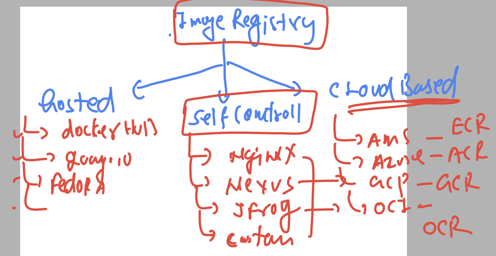
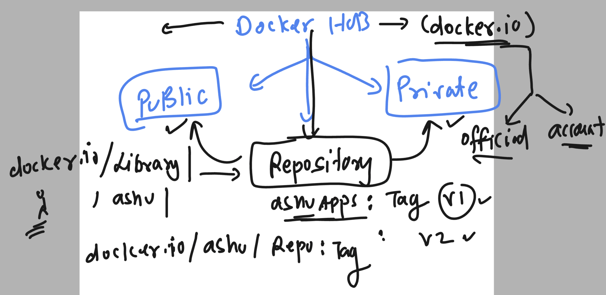

## devops mastering

### Docker Registry systems



## Image names 



### image pushing 

```
 docker tag  4018c0a75b70   docker.io/dockerashu/testingimg:v1  
➜  Desktop 
➜  Desktop docker tag  4018c0a75b70   dockerashu/testingimg:v2         
➜  Desktop 
➜  Desktop 
➜  Desktop docker login 
Authenticating with existing credentials...
Login Succeeded
➜  Desktop docker push  dockerashu/testingimg:v2 

```

