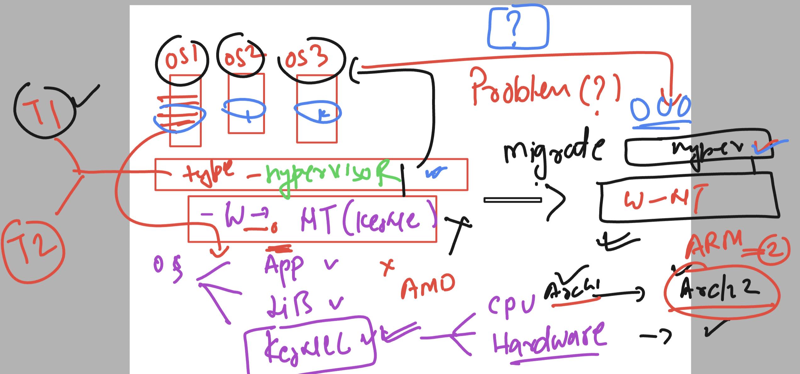
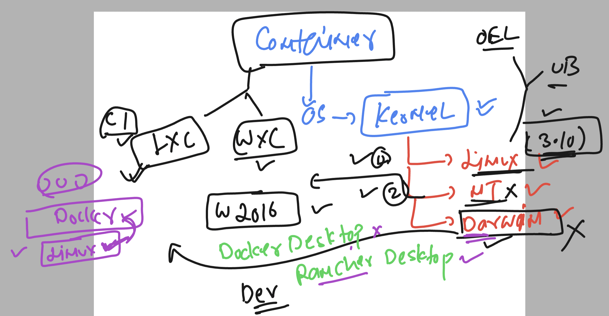

## Understanding containerization 

### cpu architecture 



### Container in Kernel supported ENV 



## Installing docker in RPM like OS -- with kernel 5.10 

### Kernel version 

```
[root@docker-server ~]# uname -r
5.10.210-201.852.amzn2.x86_64
```

### Installing docker 20 (latest version is 23) 

```
root@docker-server ~]# yum install docker -y 
Failed to set locale, defaulting to C
Loaded plugins: extras_suggestions, langpacks, priorities, update-motd
Resolving Dependencies
--> Running transaction check

```

### always create a non root user and give docker socket permission 

```
[root@docker-server ~]# useradd   test
[root@docker-server ~]# 
[root@docker-server ~]# 
[root@docker-server ~]# usermod -aG docker  test 
[root@docker-server ~]# 
[root@docker-server ~]# systemctl enable --now docker 
Created symlink from /etc/systemd/system/multi-user.target.wants/docker.service to /usr/lib/systemd/system/docker.service.
[root@docker-server ~]# 
[root@docker-server ~]# su - test
[test@docker-server ~]$ docker version 
Client:
 Version:           20.10.25
 API version:       1.41
 Go version:        go1.20.12
 Git commit:        b82b9f3
 Built:             Fri Dec 29 20:37:18 2023
 OS/Arch:           linux/amd64
 Context:           default
 Experimental:      true

Server:
 Engine:
  Version:          20.10.25
  API version:      1.41 (minimum version 1.12)
  Go version:       go1.20.12
  Git commit:       5df983c
  Built:            Fri Dec 29 20:38:05 2023
  OS/Arch:          linux/amd64
  Experimental:     false
 containerd:
  Version:          1.7.11
  GitCommit:        64b8a811b07ba6288238eefc14d898ee0b5b99ba
 runc:
  Version:          1.1.11
  GitCommit:        4bccb38cc9cf198d52bebf2b3a90cd14e7af8c06
 docker-init:
  Version:          0.19.0
  GitCommit:        de40ad0

```

