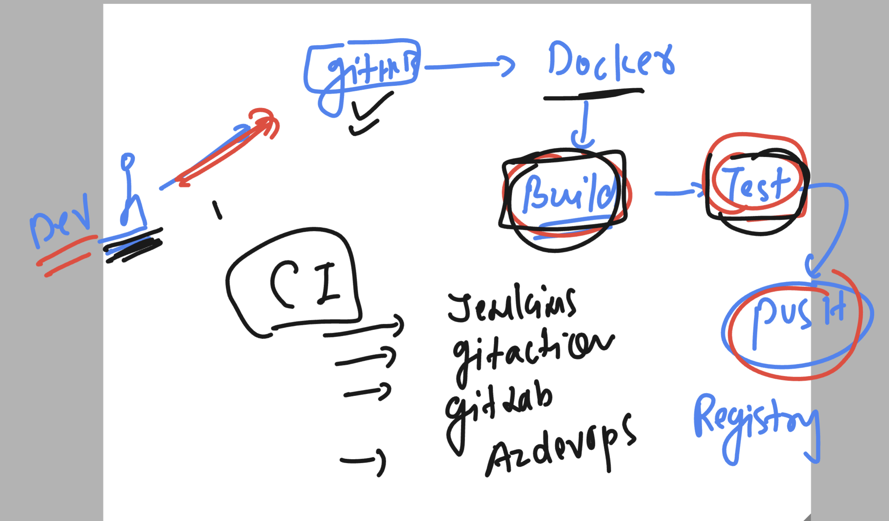
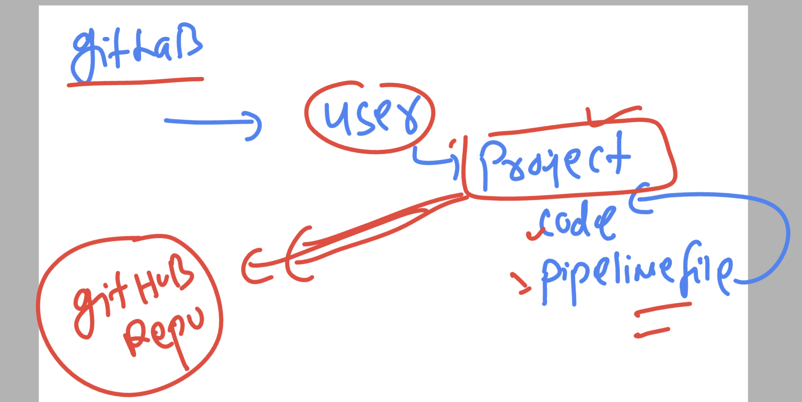

# devops_mastering

# devops_mastering

### we can use bind mount to mount volume like an existing folder

```
version: "3.8"
volumes: # creating volume 
  ashuvolnew1: # name of volume 
services:
  mywebapp:
    image: nginx
    container_name: c111
    ports:
      - 1244:80 
    volumes:
      - ashuvolnew1:/opt/mydata:rw
      - ./html-sample-app:/usr/share/nginx/html/:ro 
```
### commands

```
10343  git clone https://github.com/schoolofdevops/html-sample-app.git
10344  ls
10345  ls  html-sample-app
10346  ls
10347  docker-compose up -d
10348  ls
10349  docker-compose ps
10350  ls
10351  docker-compose ps
10352  docker-compose exec -it mywebapp  bash 
```

## To explore compose files use below link

[click_here](https://github.com/redashu/docker-compose.git)

```
https://github.com/redashu/docker-compose.git
```

## Understanding need of CI for developers and Devops people 



## Some info about Gitlab CI tool 

### gitlab setup runners in server 


## to use Gitlab plz create account 



