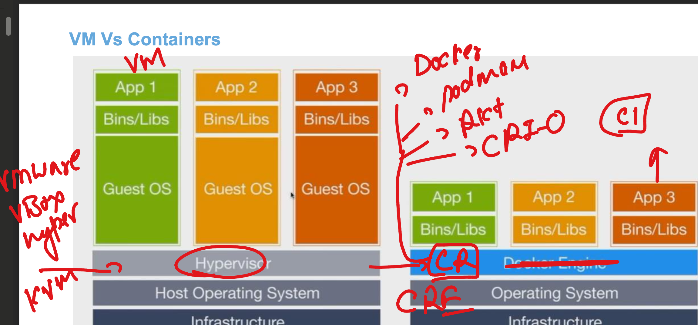
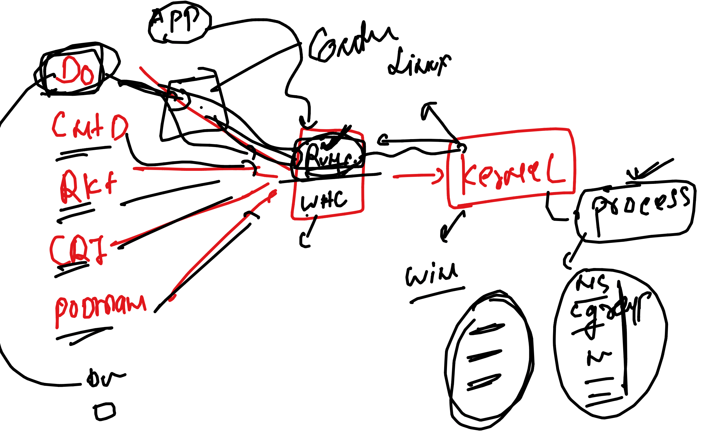
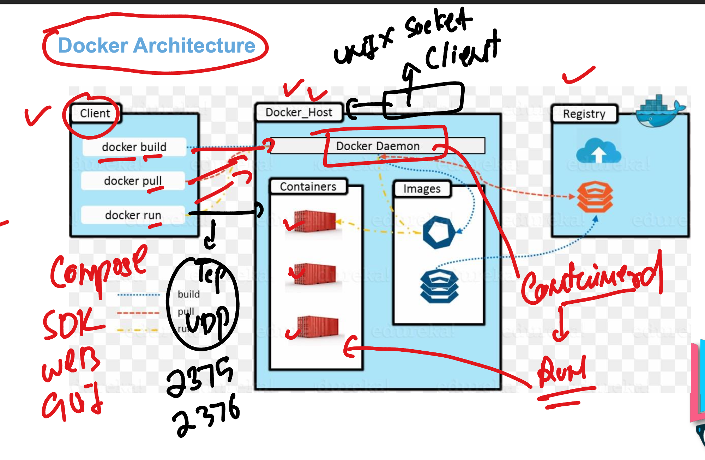

##

### CRE 



### docker vs other runtime --- runc



### whenever we install docker we get these dependenices 

```
Removing:
 containerd             x86_64             1.7.11-1.amzn2.0.1               @amzn2extra-docker             107 M
 docker                 x86_64             20.10.25-1.amzn2.0.4             @amzn2extra-docker             170 M
 libcgroup              x86_64             0.41-21.amzn2                    @amzn2-core                    134 k
 pigz                   x86_64             2.3.4-1.amzn2.0.1                @amzn2-core                    137 k
 runc                   x86_64             1.1.11-1.amzn2                   @amzn2extra-docker             9.6 M


```

### docker client and server architecture 



### docker and mirtantis story 


### pulling images 

```
[test@docker-server ~]$ docker  images 
REPOSITORY   TAG       IMAGE ID   CREATED   SIZE
[test@docker-server ~]$ docker  pull  busybox 
Using default tag: latest
latest: Pulling from library/busybox
7b2699543f22: Pull complete 
Digest: sha256:650fd573e056b679a5110a70aabeb01e26b76e545ec4b9c70a9523f2dfaf18c6
Status: Downloaded newer image for busybox:latest
docker.io/library/busybox:latest
[test@docker-server ~]$ docker  pull  alpine 
Using default tag: latest
latest: Pulling from library/alpine
4abcf2066143: Pull complete 
Digest: sha256:c5b1261d6d3e43071626931fc004f70149baeba2c8ec672bd4f27761f8e1ad6b
Status: Downloaded newer image for alpine:latest
docker.io/library/alpine:latest
[test@docker-server ~]$ docker  images
REPOSITORY   TAG       IMAGE ID       CREATED         SIZE
alpine       latest    05455a08881e   7 weeks ago     7.38MB
busybox      latest    ba5dc23f65d4   10 months ago   4.26MB
[test@docker-server ~]$ docker pull quay.io/centos7/httpd-24-centos7


[test@docker-server ~]$ docker pull quay.io/centos7/httpd-24-centos7
Using default tag: latest
latest: Pulling from centos7/httpd-24-centos7
c61d16cfe03e: Pull complete 
06c7e4737942: Pull complete 
8f001c8d7e00: Pull complete 
Digest: sha256:8dc6086af83f91bcbd28738a5665b5efdf6666426a0f964e696460811a24b739
Status: Downloaded newer image for quay.io/centos7/httpd-24-centos7:latest
quay.io/centos7/httpd-24-centos7:latest
[test@docker-server ~]$ docker  images
REPOSITORY                         TAG       IMAGE ID       CREATED         SIZE
alpine                             latest    05455a08881e   7 weeks ago     7.38MB
quay.io/centos7/httpd-24-centos7   latest    d7af31210b28   8 months ago    344MB
busybox                            latest    ba5dc23f65d4   10 months ago   4.26MB
[test@docker-server ~]$ 


```

### we can inspect images to check various details like supported kernel and cpu arch 

```
[test@docker-server ~]$ docker  inspect  05455a08881e  | grep -i cpu 
[test@docker-server ~]$ docker  inspect  05455a08881e  | grep -i arch
        "Architecture": "amd64",
[test@docker-server ~]$ docker  inspect  05455a08881e  | grep -i os
            "Hostname": "4189cbc53495",
            "Hostname": "",
        "Os": "linux",
[test@docker-server ~]$ 


```

