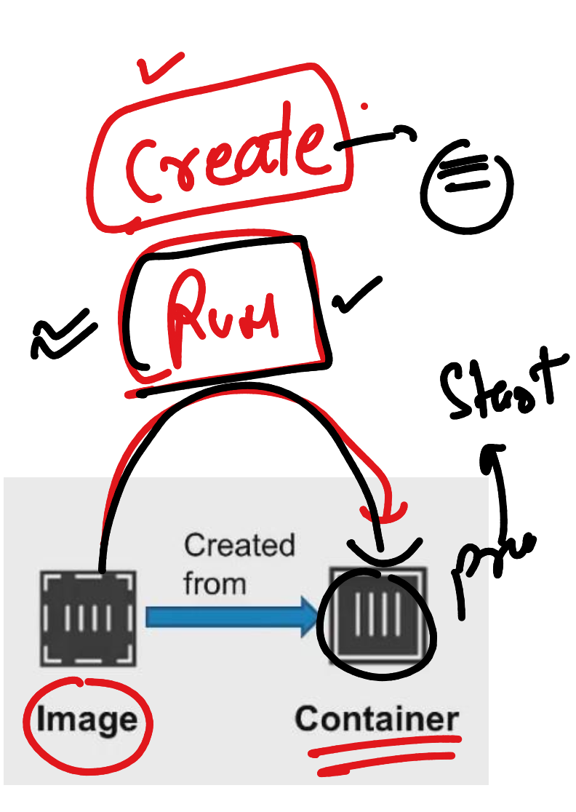
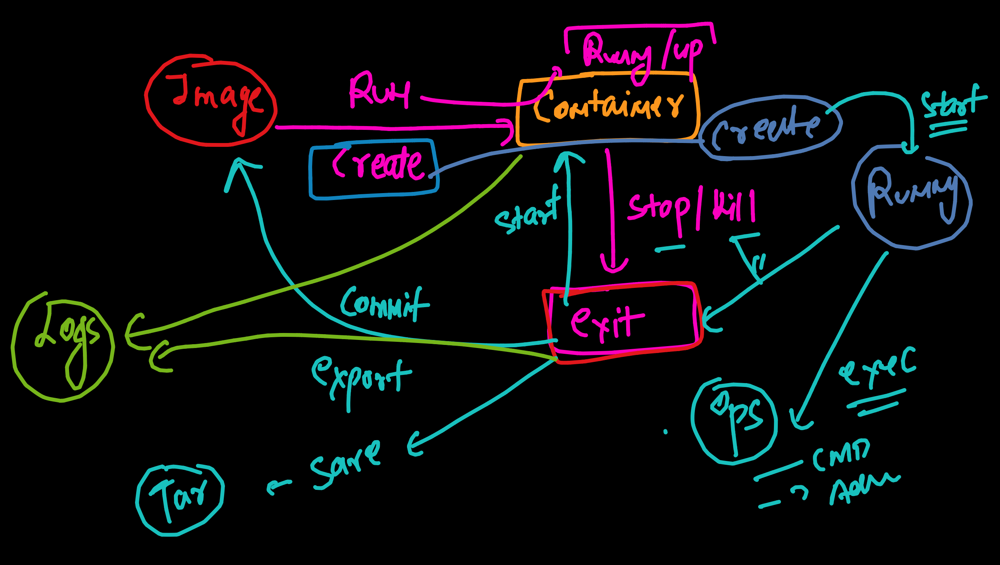
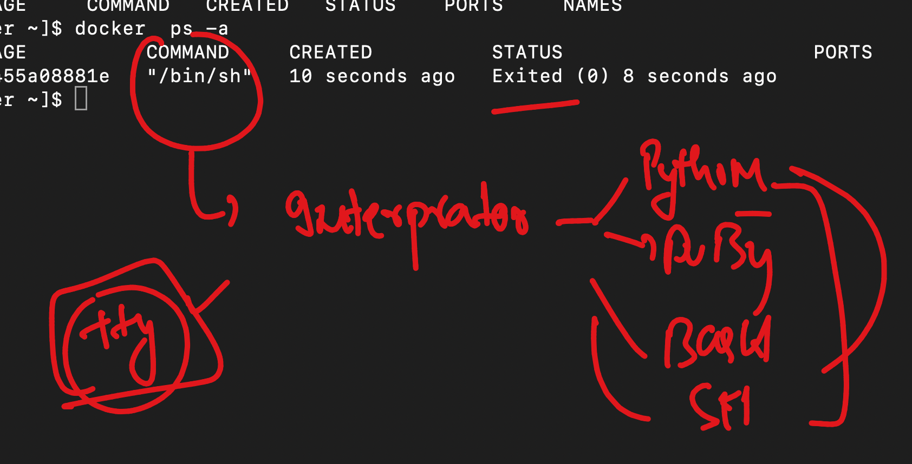

##

### CRE 


### docker vs other runtime --- runc


### whenever we install docker we get these dependenices 

```
Removing:
 containerd             x86_64             1.7.11-1.amzn2.0.1               @amzn2extra-docker             107 M
 docker                 x86_64             20.10.25-1.amzn2.0.4             @amzn2extra-docker             170 M
 libcgroup              x86_64             0.41-21.amzn2                    @amzn2-core                    134 k
 pigz                   x86_64             2.3.4-1.amzn2.0.1                @amzn2-core                    137 k
 runc                   x86_64             1.1.11-1.amzn2                   @amzn2extra-docker             9.6 M


```

### docker client and server architecture 


### docker and mirtantis story 


### pulling images 

```
[test@docker-server ~]$ docker  images 
REPOSITORY   TAG       IMAGE ID   CREATED   SIZE
[test@docker-server ~]$ docker  pull  busybox 
Using default tag: latest
latest: Pulling from library/busybox
7b2699543f22: Pull complete 
Digest: sha256:650fd573e056b679a5110a70aabeb01e26b76e545ec4b9c70a9523f2dfaf18c6
Status: Downloaded newer image for busybox:latest
docker.io/library/busybox:latest
[test@docker-server ~]$ docker  pull  alpine 
Using default tag: latest
latest: Pulling from library/alpine
4abcf2066143: Pull complete 
Digest: sha256:c5b1261d6d3e43071626931fc004f70149baeba2c8ec672bd4f27761f8e1ad6b
Status: Downloaded newer image for alpine:latest
docker.io/library/alpine:latest
[test@docker-server ~]$ docker  images
REPOSITORY   TAG       IMAGE ID       CREATED         SIZE
alpine       latest    05455a08881e   7 weeks ago     7.38MB
busybox      latest    ba5dc23f65d4   10 months ago   4.26MB
[test@docker-server ~]$ docker pull quay.io/centos7/httpd-24-centos7


[test@docker-server ~]$ docker pull quay.io/centos7/httpd-24-centos7
Using default tag: latest
latest: Pulling from centos7/httpd-24-centos7
c61d16cfe03e: Pull complete 
06c7e4737942: Pull complete 
8f001c8d7e00: Pull complete 
Digest: sha256:8dc6086af83f91bcbd28738a5665b5efdf6666426a0f964e696460811a24b739
Status: Downloaded newer image for quay.io/centos7/httpd-24-centos7:latest
quay.io/centos7/httpd-24-centos7:latest
[test@docker-server ~]$ docker  images
REPOSITORY                         TAG       IMAGE ID       CREATED         SIZE
alpine                             latest    05455a08881e   7 weeks ago     7.38MB
quay.io/centos7/httpd-24-centos7   latest    d7af31210b28   8 months ago    344MB
busybox                            latest    ba5dc23f65d4   10 months ago   4.26MB
[test@docker-server ~]$ 


```

### we can inspect images to check various details like supported kernel and cpu arch 

```
[test@docker-server ~]$ docker  inspect  05455a08881e  | grep -i cpu 
[test@docker-server ~]$ docker  inspect  05455a08881e  | grep -i arch
        "Architecture": "amd64",
[test@docker-server ~]$ docker  inspect  05455a08881e  | grep -i os
            "Hostname": "4189cbc53495",
            "Hostname": "",
        "Os": "linux",
[test@docker-server ~]$ 


```

### Creating contaienr from docker images 



### life of a container 



### all interpretor need tty support 



### docker run ops

```
[test@docker-server ~]$ docker run   05455a08881e 
[test@docker-server ~]$ docker  ps
CONTAINER ID   IMAGE     COMMAND   CREATED   STATUS    PORTS     NAMES
[test@docker-server ~]$ docker  ps -a
CONTAINER ID   IMAGE          COMMAND     CREATED          STATUS                     PORTS     NAMES
3a950086b087   05455a08881e   "/bin/sh"   10 seconds ago   Exited (0) 8 seconds ago             busy_kepler
[test@docker-server ~]$ 
[test@docker-server ~]$ docker run  -it  05455a08881e 
/ # ls
bin    etc    lib    mnt    proc   run    srv    tmp    var
dev    home   media  opt    root   sbin   sys    usr
/ # exit
[test@docker-server ~]$ docker  ps
CONTAINER ID   IMAGE     COMMAND   CREATED   STATUS    PORTS     NAMES
[test@docker-server ~]$ docker  ps -a
CONTAINER ID   IMAGE          COMMAND     CREATED          STATUS                      PORTS     NAMES
0afe9f98f5a5   05455a08881e   "/bin/sh"   27 seconds ago   Exited (0) 16 seconds ago             determined_saha
3a950086b087   05455a08881e   "/bin/sh"   9 minutes ago    Exited (0) 9 minutes ago              busy_kepler
[test@docker-server ~]$ 
[test@docker-server ~]$ docker run  -it -d   05455a08881e 
d40207b2baee817de15da0056fa3495ee8d4509673d80d178793dd2d6bcedd0f
[test@docker-server ~]$ docker  ps
CONTAINER ID   IMAGE          COMMAND     CREATED         STATUS        PORTS     NAMES
d40207b2baee   05455a08881e   "/bin/sh"   3 seconds ago   Up 1 second             thirsty_robinson
[test@docker-server ~]$ 

```

### more options 

```
[test@docker-server ~]$ docker run  -itd --name ashuc1   05455a08881e 
3abb3abddeb538a86c5d88bed1f67b202ebdf3958814f21bd27046c7c6720769
[test@docker-server ~]$ docker  ps
CONTAINER ID   IMAGE          COMMAND     CREATED         STATUS         PORTS     NAMES
3abb3abddeb5   05455a08881e   "/bin/sh"   2 seconds ago   Up 1 second              ashuc1
d40207b2baee   05455a08881e   "/bin/sh"   2 minutes ago   Up 2 minutes             thirsty_robinson
[test@docker-server ~]$ 

```

### container life cycle 


### we can do more in process management using docker contaienr from linxu 

```
[root@docker-server ~]# docker ps
CONTAINER ID   IMAGE          COMMAND     CREATED          STATUS          PORTS     NAMES
d40207b2baee   05455a08881e   "/bin/sh"   16 minutes ago   Up 16 minutes             thirsty_robinson
[root@docker-server ~]# docker  start  ashuc1
ashuc1
[root@docker-server ~]# docker inspect  ashuc1  | grep -i pid
            "Pid": 6539,
            "PidMode": "",
            "PidsLimit": null,
[root@docker-server ~]# 
[root@docker-server ~]# 
[root@docker-server ~]# cd  /proc/6539
[root@docker-server 6539]# ls
arch_status  cmdline          exe      limits     mounts      oom_score      root       smaps_rollup  task
attr         comm             fd       loginuid   mountstats  oom_score_adj  sched      stack         timens_offsets
autogroup    coredump_filter  fdinfo   map_files  net         pagemap        schedstat  stat          timers
auxv         cpuset           gid_map  maps       ns          patch_state    sessionid  statm         timerslack_ns
cgroup       cwd              io       mem        numa_maps   personality    setgroups  status        uid_map
clear_refs   environ          latency  mountinfo  oom_adj     projid_map     smaps      syscall       wchan
[root@docker-server 6539]# ls  ns/
cgroup  ipc  mnt  net  pid  pid_for_children  time  time_for_children  user  uts
```

