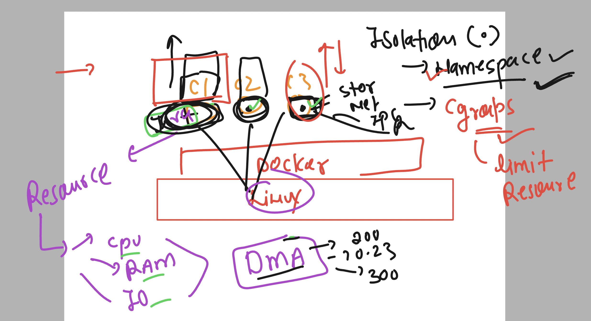
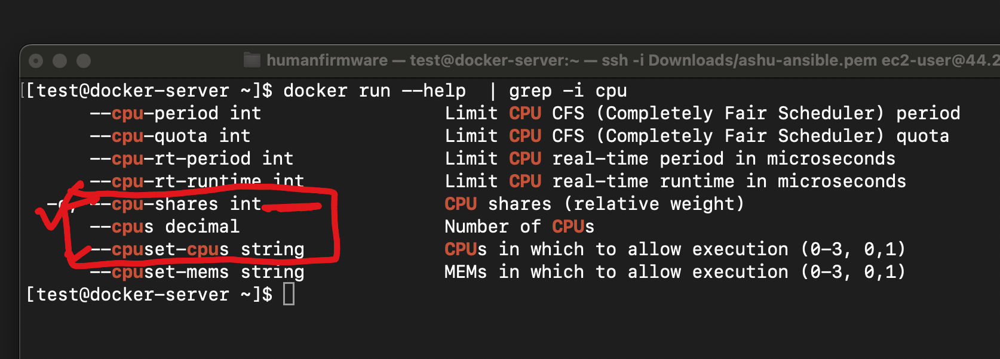

# devops_mastering

### Vidoes link for docker Desktop installation 


### link 1 
(https://www.youtube.com/watch?v=MwwF-dWtEAk)[click_here]

### link 2 

(https://www.youtube.com/watch?v=MwwF-dWtEAk)[click_here]


## Namespaces and Cgroups in linux contaienrs 



### checking rsource of live contaienr using stats --- / Monitoring tool 

```
[root@docker-server ~]# docker   stats  ashuc2 

CONTAINER ID   NAME      CPU %     MEM USAGE / LIMIT   MEM %     NET I/O     BLOCK I/O   PIDS
7ad40a6423bf   ashuc2    0.00%     868KiB / 3.816GiB   0.02%     710B / 0B   0B / 0B     1
^C

```

### we can limit MEMORY in containers 

```
[test@docker-server ~]$ docker  run -itd --name ashuc3  --memory 400M  oraclelinux:8.5 
be87422aa48a5b17e857a072954773188a593fcef4362833c86e4f9a3b4953a4

```

### More info about CPU operations in docker contaienr 



