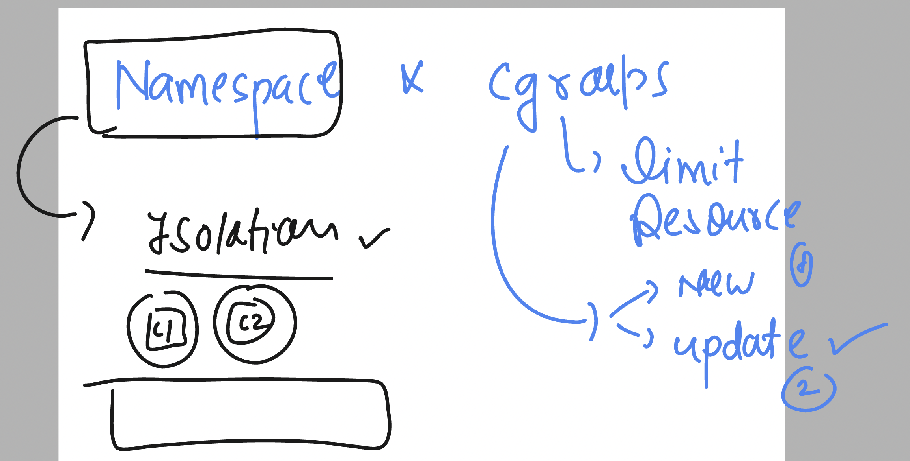
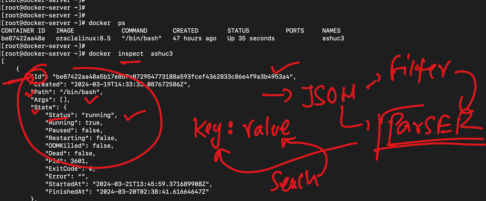
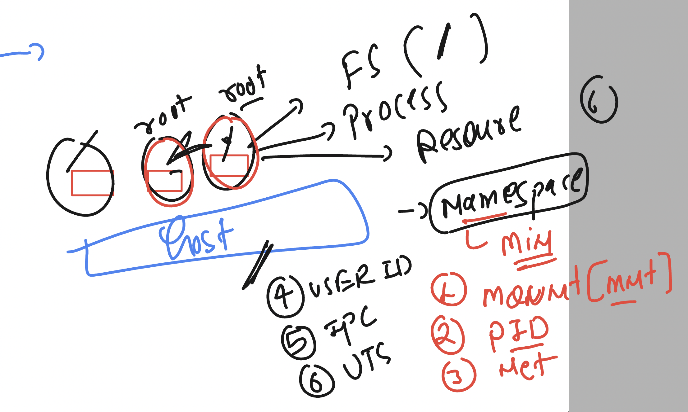
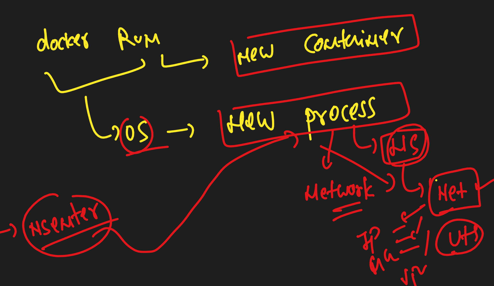

###  Revision of Cgroups and namespaces 



### JSOn parser to filter container or image inspect details 



### filter particular things 

```
[root@docker-server ~]# docker  inspect  ashuc3  --format='{{.Id}}'
be87422aa48a5b17e857a072954773188a593fcef4362833c86e4f9a3b4953a4
[root@docker-server ~]# 
[root@docker-server ~]# docker  inspect  ashuc3  --format='{{.State.Status}}'
running
[root@docker-server ~]# docker  inspect  ashuc3  --format='{{.NetworkSettings.IPAddress}}'
172.17.0.2
[root@docker-server ~]# docker  inspect  ashuc3  --format='{{.State.Pid}}'
3601

```
### in general there are 6 namespaces where containers need seperation 


### checking namespace list for sshd process id 

```
[root@docker-server ~]# pidof  sshd
3469 3451 3194
[root@docker-server ~]# 
[root@docker-server ~]# cd  /proc/3194
[root@docker-server 3194]# ls
arch_status  clear_refs       cwd      gid_map   map_files  mountstats  oom_score      projid_map  setgroups     statm           timers
attr         cmdline          environ  io        maps       net         oom_score_adj  root        smaps         status          timerslack_ns
autogroup    comm             exe      latency   mem        ns          pagemap        sched       smaps_rollup  syscall         uid_map
auxv         coredump_filter  fd       limits    mountinfo  numa_maps   patch_state    schedstat   stack         task            wchan
cgroup       cpuset           fdinfo   loginuid  mounts     oom_adj     personality    sessionid   stat          timens_offsets
[root@docker-server 3194]# cd ns/
[root@docker-server ns]# pwd
/proc/3194/ns
[root@docker-server ns]# ls
cgroup  ipc  mnt  net  pid  pid_for_children  time  time_for_children  user  uts
[root@docker-server ns]# 

```

### listing namespaces 

```
[root@docker-server ns]# lsns 
        NS TYPE   NPROCS   PID USER   COMMAND
4026531835 cgroup    110     1 root   /usr/lib/systemd/systemd --switched-root --system --deserialize 21
4026531836 pid       109     1 root   /usr/lib/systemd/systemd --switched-root --system --deserialize 21
4026531837 user      110     1 root   /usr/lib/systemd/systemd --switched-root --system --deserialize 21
4026531838 uts       109     1 root   /usr/lib/systemd/systemd --switched-root --system --deserialize 21
4026531839 ipc       109     1 root   /usr/lib/systemd/systemd --switched-root --system --deserialize 21
4026531840 mnt       107     1 root   /usr/lib/systemd/systemd --switched-root --system --deserialize 21
4026531860 mnt         1    22 root   kdevtmpfs
4026532088 net       109     1 root   /usr/lib/systemd/systemd --switched-root --system --deserialize 21
4026532261 mnt         1  2712 chrony /usr/sbin/chronyd -F 2
4026532268 mnt         1  3601 root   /bin/bash
4026532269 uts         1  3601 root   /bin/bash
4026532270 ipc         1  3601 root   /bin/bash
4026532271 pid         1  3601 root   /bin/bash
4026532273 net         1  3601 root   /bin/bash
[root@docker-server ns]# 
[root@docker-server ns]# 
[root@docker-server ns]# lsns    | cutd -d" "  -f2
-bash: cutd: command not found
[root@docker-server ns]# lsns    | cut  -d" "  -f2

cgroup
pid
user
uts
ipc
mnt
mnt
net
mnt
mnt
uts
ipc
pid
net
[root@docker-server ns]# lsns    | cut  -d" "  -f2  | uniq

cgroup
pid
user
uts
ipc
mnt
net
mnt
uts
ipc
pid
net

```

### more info about Namespaces 



###  demo of network namespace access in contaienr process

```
[root@docker-server ~]# docker  inspect  ashuc3  --format='{{.State.Pid}}'
3601
[root@docker-server ~]# 
[root@docker-server ~]# 
[root@docker-server ~]# nsenter  -t 3601  --net   ifconfig 
eth0: flags=4163<UP,BROADCAST,RUNNING,MULTICAST>  mtu 1500
        inet 172.17.0.2  netmask 255.255.0.0  broadcast 172.17.255.255
        ether 02:42:ac:11:00:02  txqueuelen 0  (Ethernet)
        RX packets 17  bytes 1430 (1.3 KiB)
        RX errors 0  dropped 0  overruns 0  frame 0
        TX packets 0  bytes 0 (0.0 B)
        TX errors 0  dropped 0 overruns 0  carrier 0  collisions 0

lo: flags=73<UP,LOOPBACK,RUNNING>  mtu 65536
        inet 127.0.0.1  netmask 255.0.0.0
        loop  txqueuelen 1000  (Local Loopback)
        RX packets 0  bytes 0 (0.0 B)
        RX errors 0  dropped 0  overruns 0  frame 0
        TX packets 0  bytes 0 (0.0 B)
        TX errors 0  dropped 0 overruns 0  carrier 0  collisions 0

[root@docker-server ~]# nsenter  -t 3601  --net   ip a
1: lo: <LOOPBACK,UP,LOWER_UP> mtu 65536 qdisc noqueue state UNKNOWN group default qlen 1000
    link/loopback 00:00:00:00:00:00 brd 00:00:00:00:00:00
    inet 127.0.0.1/8 scope host lo
       valid_lft forever preferred_lft forever
4: eth0@if5: <BROADCAST,MULTICAST,UP,LOWER_UP> mtu 1500 qdisc noqueue state UP group default 
    link/ether 02:42:ac:11:00:02 brd ff:ff:ff:ff:ff:ff link-netnsid 0
    inet 172.17.0.2/16 brd 172.17.255.255 scope global eth0
       valid_lft forever preferred_lft forever
[root@docker-server ~]# docker  exec ashuc3  ip  a
1: lo: <LOOPBACK,UP,LOWER_UP> mtu 65536 qdisc noqueue state UNKNOWN group default qlen 1000
    link/loopback 00:00:00:00:00:00 brd 00:00:00:00:00:00
    inet 127.0.0.1/8 scope host lo
       valid_lft forever preferred_lft forever
4: eth0@if5: <BROADCAST,MULTICAST,UP,LOWER_UP> mtu 1500 qdisc noqueue state UP group default 
    link/ether 02:42:ac:11:00:02 brd ff:ff:ff:ff:ff:ff link-netnsid 0
    inet 172.17.0.2/16 brd 172.17.255.255 scope global eth0
       valid_lft forever preferred_lft forever
[root@docker-server ~]# 

```

### another demo

```
[root@docker-server ~]# nsenter  -t 3601  --uts --mount   bash 
[root@be87422aa48a /]# 
[root@be87422aa48a /]# 
[root@be87422aa48a /]# ls
bin  boot  dev  etc  home  lib  lib64  media  mnt  opt  proc  root  run  sbin  srv  sys  tmp  usr  var
[root@be87422aa48a /]# cd /opt/
[root@be87422aa48a opt]# ls
[root@be87422aa48a opt]# cd
[root@be87422aa48a ~]# ls
[root@be87422aa48a ~]# exit
exit

```


