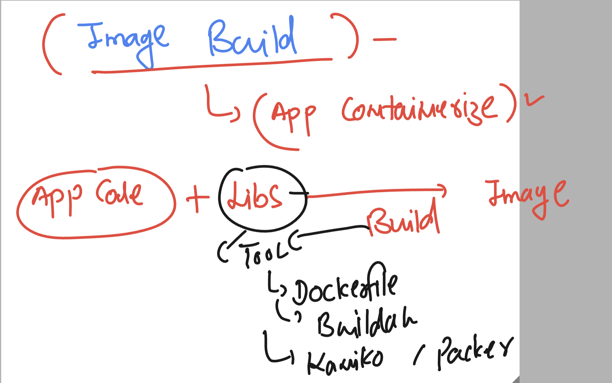

# devops_mastering

### app containerization or image building 



### giving non root access to docker group as user 

```
root@docker-server ~]# 
[root@docker-server ~]# useradd  devapp
[root@docker-server ~]# usermod -aG docker  devapp
[root@docker-server ~]# passwd devapp
Changing password for user devapp.
New password: 
BAD PASSWORD: The password is shorter than 7 characters
Retype new password: 
passwd: all authentication tokens updated successfully.
[root@docker-server ~]# systemctl restart  docker 
[root@docker-server ~]# 


```

### --- giving permission to currently sessioned user

```
[root@docker-server ~]# usermod -aG docker t3
[root@docker-server ~]# 
[root@docker-server ~]# chmod 777 /var/run/docker.sock
[root@docker-server ~]# 

```

## python code image building 

### hello.py

```
import time
import subprocess
# checking current os version 
os_details=subprocess.getoutput('cat /etc/os-release')
while True:
    print("Hello world i am running in container")
    time.sleep(1)
    print("_____________")
    print("container os Libs is ")
    print(os_details)
    print("_____________")
    print("_____________")
    time.sleep(2)

```

### Dockerfile 

```
FROM python 
# pulling python image from docker hub 
LABEL name=ashutoshh
LABEL email=ashutoshh@linux.com 
RUN mkdir -p /opt/mycode/
COPY hello.py /opt/mycode/
CMD ["python","/opt/mycode/hello.py"]

```

### newdockerfile

```
FROM oraclelinux:8.4  
# pulling python image from docker hub 
LABEL name=ashutoshh
LABEL email=ashutoshh@linux.com 
RUN dnf install python3 -y 
RUN mkdir -p /opt/mycode/
COPY hello.py /opt/mycode/
CMD ["python3","/opt/mycode/hello.py"] 
```

### building commands 

```
 docker build -t ashunewpy:v11 -f ol8python.dockerfile  . 
```

