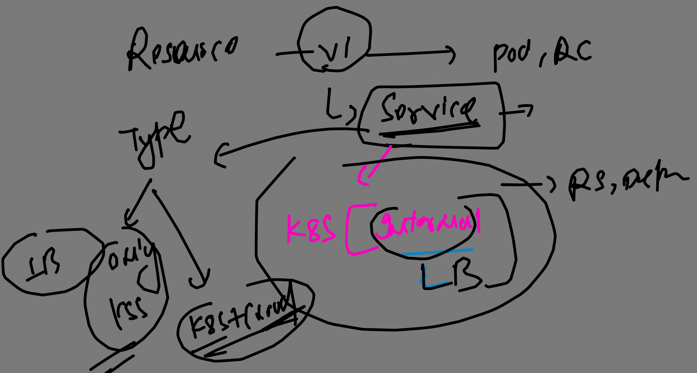
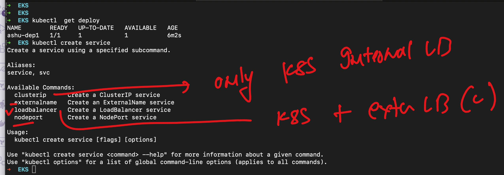

# devops_mastering

### default location of  Control plane cred file 

```
 ls  ~/.kube
cache  config
➜  EKS cat ~/.kube/config 
apiVersion: v1
clusters:
- cluster:
    certificate-authority-data: LS0tLS1CRUdJTiBDRVJUSUZJQ0FURS0tLS0tCk1JSURCVENDQWUyZ0F3SUJBZ0lJUUpsenhxZCtMRVF3RFFZSktvWklodmNOQVFFTEJRQXdGVEVUTUJFR0ExVUUKQXhNS2EzVmlaWEp1WlhSbGN6QWVGdzB5TkRBME1UVXdOelUwTXpsYUZ3MHpOREEwTVRNd056VTVNemxhTUJVeApFekFSQmdOVkJBTVRDbXQxWW1WeWJtVjBaWE13Z2dFaU1BMEdDU3FHU0liM0RRRUJBUVVBQTRJQkR3QXdnZ0VLCkFvSUJBUUNwU0tkWUR5ZGo4bTBWc2pZRkxOQmZLZDhXRmVxV3NXL0FCa1Vid1JtanBVWGRpT1BKdlBYbVVDNGYKbitjUmxWZU1tSVYxTVJqdmhDT2NGR0FTSWVrT2pkcVpuTEFXMlNkcnlJNDZBcCtSZGFWZTNxNHN2YXppeHd1NQpGVmZIaTlXbzdjcDVGalUxOHBPQnpNRU9UWnFHMUdQaDk0QU9TTXR2UjlXNDh2blJOWkJXN09JSjY0K0hXM2hyCmtaQXVkS21pUEx6MTZmeUJHZ0FVM2lUTmpuckVLVG1nMUIwTmtMK21FQXQvU1JhQmF1SnZ
```

### locating other locaiton 

```
 kubectl  get nodes --kubeconfig  /tmp/config 
NAME                                           STATUS   ROLES    AGE   VERSION
ip-192-168-22-5.ap-south-1.compute.internal    Ready    <none>   35m   v1.29.0-eks-5e0fdde
ip-192-168-45-35.ap-south-1.compute.internal   Ready    <none>   35m   v1.29.0-eks-5e0fdde

```

### Testing Networking of pod to access app 

```
 kubectl create -f  ../ashu-k8s-manifest/deploy1.yaml 
deployment.apps/ashu-dep1 created
➜  k8s git:(master) ✗ 
```

### verify 

```
kubectl  get deploy
NAME        READY   UP-TO-DATE   AVAILABLE   AGE
ashu-dep1   1/1     1            1           30s
➜  EKS kubectl  get rs    
NAME                  DESIRED   CURRENT   READY   AGE
ashu-dep1-9c8b4d864   1         1         1       33s
➜  EKS kubectl  get po
NAME                        READY   STATUS    RESTARTS   AGE
ashu-dep1-9c8b4d864-b2m29   1/1     Running   0          35s
➜  EKS kubectl  get no
NAME                                           STATUS   ROLES    AGE   VERSION
ip-192-168-22-5.ap-south-1.compute.internal    Ready    <none>   36m   v1.29.0-eks-5e0fdde
ip-192-168-45-35.ap-south-1.compute.internal   Ready    <none>   36m   v1.29.0-eks-5e0fdde
➜  EKS kubectl  get po -o wide
NAME                        READY   STATUS    RESTARTS   AGE   IP               NODE                                           NOMINATED NODE   READINESS GATES
ashu-dep1-9c8b4d864-b2m29   1/1     Running   0          43s   192.168.35.175   ip-192-168-45-35.ap-south-1.compute.internal   <none>           <none>
➜  EKS 

```

### access pod app using same machine which is k8s client 

```
S kubectl  port-forward  ashu-dep1-9c8b4d864-b2m29  1234:80  
Forwarding from 127.0.0.1:1234 -> 80
Forwarding from [::1]:1234 -> 80

```

### we can change app code 

```
kubectl get po 
NAME                        READY   STATUS    RESTARTS   AGE
ashu-dep1-9c8b4d864-b2m29   1/1     Running   0          3m12s
➜  Desktop 
➜  Desktop 
➜  Desktop kubectl  exec -it  ashu-dep1-9c8b4d864-b2m29  -- bash 
root@ashu-dep1-9c8b4d864-b2m29:/# 
root@ashu-dep1-9c8b4d864-b2m29:/# 
root@ashu-dep1-9c8b4d864-b2m29:/# cd /usr/share/nginx/html/
root@ashu-dep1-9c8b4d864-b2m29:/usr/share/nginx/html# ls
50x.html  index.html
root@ashu-dep1-9c8b4d864-b2m29:/usr/share/nginx/html# echo hello ashutoshh >index.html 
root@ashu-dep1-9c8b4d864-b2m29:/usr/share/nginx/html# 


```

## Introduction to service of K8s and controller of CLoud 



### type of service 




### Creating service using expose 

```
kubectl  get  deploy
NAME        READY   UP-TO-DATE   AVAILABLE   AGE
ashu-dep1   1/1     1            1           13m
➜  EKS 
➜  EKS 
➜  EKS kubectl  expose deployment  ashu-dep1  --type LoadBalancer  --port 80  --name ashulb1 --dry-run=client -o yaml 
apiVersion: v1
kind: Service
metadata:
  creationTimestamp: null
  labels:
    app: ashu-dep1
  name: ashulb1
spec:
  ports:
  - port: 80
    protocol: TCP
    targetPort: 80
  selector:
    app: ashu-dep1
  type: LoadBalancer
status:
  loadBalancer: {}

```

### Creating LB 

```
 kubectl  create -f  ../ashu-k8s-manifest/k8s-svc1.yaml 
service/ashulb1 created
➜  k8s git:(master) ✗ kubectl  get  svc
NAME         TYPE           CLUSTER-IP      EXTERNAL-IP                                                                PORT(S)        AGE
ashulb1      LoadBalancer   10.100.210.56   a24ae8e44f7fa409294fe40a7a6c3dd0-2019082553.ap-south-1.elb.amazonaws.com   80:31638/TCP   21s
kubernetes   ClusterIP      10.100.0.1      <none>                                                                     443/TCP        58m
➜  k8s git:(master) ✗ 

```

