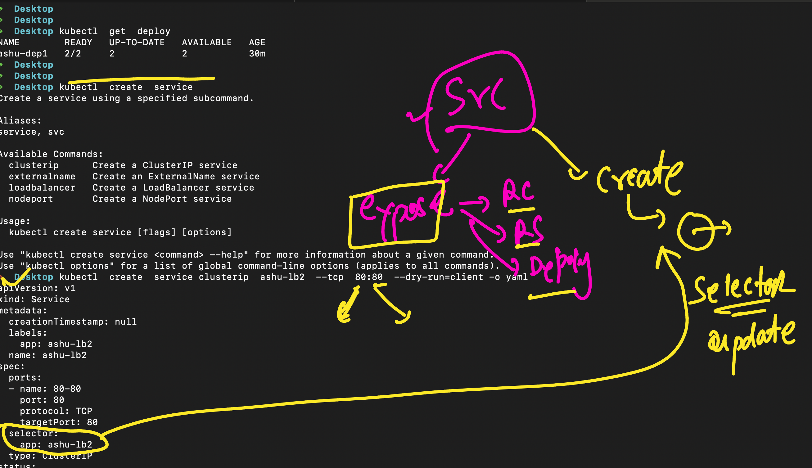

# devops_mastering -- Day 11

## Lets deploy app and access it from outside 

### Undesstaing Arch 


## Service Understanding again 


## Note: Service IP range managed by COntrol plane only -- we can change that range while setup of k8s 
### concept is network config 

### Service is also using selector to find pods using label 


### checking endpoints 

```
kubectl  get  svc
NAME         TYPE        CLUSTER-IP       EXTERNAL-IP   PORT(S)   AGE
ashu-lb      ClusterIP   10.100.118.235   <none>        80/TCP    16m
kubernetes   ClusterIP   10.100.0.1       <none>        443/TCP   8h
➜  ashu-k8s-manifest git:(master) ✗ 
➜  ashu-k8s-manifest git:(master) ✗ 
➜  ashu-k8s-manifest git:(master) ✗ kubectl  get  ep ashu-lb 
NAME      ENDPOINTS           AGE
ashu-lb   192.168.35.175:80   16m

```

##  on scale EP is gonna auto update

```
 ashu-k8s-manifest git:(master) ✗ kubectl  get deploy
NAME        READY   UP-TO-DATE   AVAILABLE   AGE
ashu-dep1   1/1     1            1           25m
➜  ashu-k8s-manifest git:(master) ✗ kubectl  scale deploy ashu-dep1  --replicas=3
deployment.apps/ashu-dep1 scaled
➜  ashu-k8s-manifest git:(master) ✗ kubectl  get deploy                          
NAME        READY   UP-TO-DATE   AVAILABLE   AGE
ashu-dep1   2/3     3            2           25m
➜  ashu-k8s-manifest git:(master) ✗ kubectl  get deploy
NAME        READY   UP-TO-DATE   AVAILABLE   AGE
ashu-dep1   3/3     3            3           25m
➜  ashu-k8s-manifest git:(master) ✗ kubectl  get  po   
NAME                        READY   STATUS    RESTARTS   AGE
ashu-dep1-9c8b4d864-5srwg   1/1     Running   0          25m
ashu-dep1-9c8b4d864-cv7q6   1/1     Running   0          11s
ashu-dep1-9c8b4d864-m6z7t   1/1     Running   0          11s
➜  ashu-k8s-manifest git:(master) ✗ kubectl  get   ep ashu-lb 
NAME      ENDPOINTS                                             AGE
ashu-lb   192.168.3.43:80,192.168.32.150:80,192.168.35.175:80   18m
➜  ashu-k8s-manifest git:(master) ✗ kubectl  scale deploy ashu-dep1  --replicas=2
deployment.apps/ashu-dep1 scaled
➜  ashu-k8s-manifest git:(master) ✗ kubectl  get   ep ashu-lb                    
NAME      ENDPOINTS                           AGE
ashu-lb   192.168.3.43:80,192.168.35.175:80   18m
➜  ashu-k8s-manifest git:(master) ✗ 
```
### overall 

```
kubectl get deploy
NAME        READY   UP-TO-DATE   AVAILABLE   AGE
ashu-dep1   2/2     2            2           27m
➜  Desktop kubectl get rs    
NAME                  DESIRED   CURRENT   READY   AGE
ashu-dep1-9c8b4d864   2         2         2       27m
➜  Desktop kubectl get po
NAME                        READY   STATUS    RESTARTS   AGE
ashu-dep1-9c8b4d864-5srwg   1/1     Running   0          27m
ashu-dep1-9c8b4d864-cv7q6   1/1     Running   0          2m21s
➜  Desktop kubectl get po --show-labes
error: unknown flag: --show-labes
See 'kubectl get --help' for usage.
➜  Desktop kubectl get po --show-labels
NAME                        READY   STATUS    RESTARTS   AGE     LABELS
ashu-dep1-9c8b4d864-5srwg   1/1     Running   0          28m     app=ashu-dep1,pod-template-hash=9c8b4d864
ashu-dep1-9c8b4d864-cv7q6   1/1     Running   0          2m32s   app=ashu-dep1,pod-template-hash=9c8b4d864
➜  Desktop 
➜  Desktop 
➜  Desktop kubectl get  svc
NAME         TYPE        CLUSTER-IP       EXTERNAL-IP   PORT(S)   AGE
ashu-lb      ClusterIP   10.100.118.235   <none>        80/TCP    21m
kubernetes   ClusterIP   10.100.0.1       <none>        443/TCP   8h
➜  Desktop 
➜  Desktop kubectl get   ep 
NAME         ENDPOINTS                               AGE
ashu-lb      192.168.3.43:80,192.168.35.175:80       21m

```

### more on service 



### Overall k8s svc 


## setup EKS using eksctl 

### create a file called cluster.yml

```
apiVersion: eksctl.io/v1alpha5
kind: ClusterConfig

metadata:
  name: devops-cluster
  region: ap-south-1
  version: "1.29"

nodeGroups:
  - name: nodepool-1
    instanceType: t2.medium
    desiredCapacity: 2
    volumeSize: 30
```

### now we can create cluster 

```
eksctl  create  cluster  -f  cluster.yaml 
```

### in case kubeconfi is not updateing then 

```
eksctl  utils  write-kubeconfig   --cluster=devops-cluster   --kubeconfig=~/.kube/config 
```

## now you check 

```
kubectl get nodes
```

