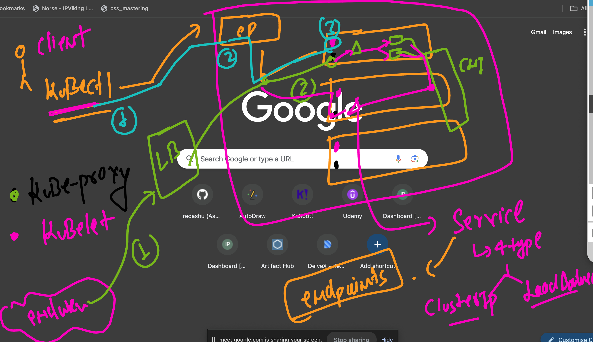
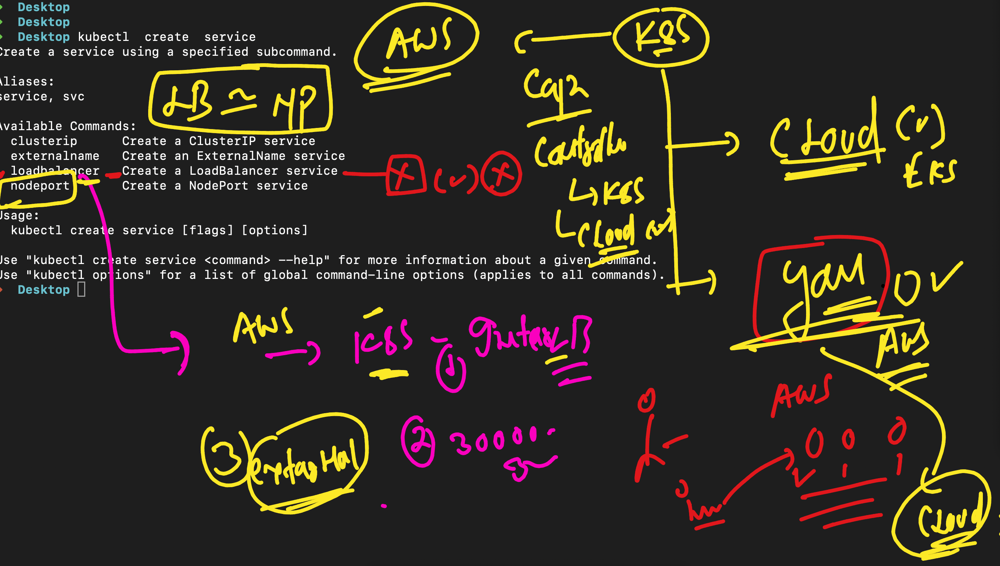
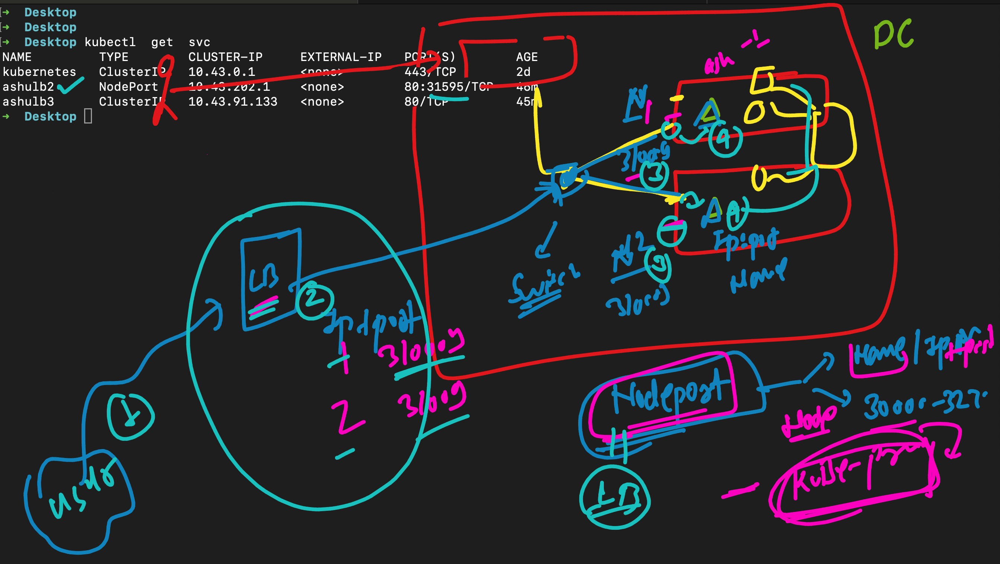

# devops_mastering -- Day 12

## how to setup k8s in ec2 vm 

[watch_to_click]('https://www.youtube.com/watch?v=TTzbQdu30YA')


### Revision 



### 

```
 kubectl config get-contexts 
CURRENT   NAME                                                      CLUSTER                                                   AUTHINFO                                                  NAMESPACE
          arn:aws:eks:us-east-1:751136288263:cluster/roche-eks-cp   arn:aws:eks:us-east-1:751136288263:cluster/roche-eks-cp   arn:aws:eks:us-east-1:751136288263:cluster/roche-eks-cp   ashu-apps
          iam-root-account@jpmc-cluster.us-east-1.eksctl.io         jpmc-cluster.us-east-1.eksctl.io                          iam-root-account@jpmc-cluster.us-east-1.eksctl.io         
          rancher-desktop                                           rancher-desktop                                           rancher-desktop                                           
          videos@jpmc-cluster.us-east-1.eksctl.io                   jpmc-cluster.us-east-1.eksctl.io                          videos@jpmc-cluster.us-east-1.eksctl.io                   
➜  Desktop kubectl  config use-context rancher-desktop
Switched to context "rancher-desktop".
➜  Desktop 
➜  Desktop kubectl config get-contexts                
CURRENT   NAME                                                      CLUSTER                                                   AUTHINFO                                                  NAMESPACE
          arn:aws:eks:us-east-1:751136288263:cluster/roche-eks-cp   arn:aws:eks:us-east-1:751136288263:cluster/roche-eks-cp   arn:aws:eks:us-east-1:751136288263:cluster/roche-eks-cp   ashu-apps
          iam-root-account@jpmc-cluster.us-east-1.eksctl.io         jpmc-cluster.us-east-1.eksctl.io                          iam-root-account@jpmc-cluster.us-east-1.eksctl.io         
*         rancher-desktop                                           rancher-desktop                                           rancher-desktop                                           
          videos@jpmc-cluster.us-east-
```

### Understanding nodeport service 

```
) ✗ kubectl create -f deploy1.yaml 
deployment.apps/ashu-dep1 created
➜  ashu-k8s-manifest git:(master) ✗ kubectl  get  deploy
NAME        READY   UP-TO-DATE   AVAILABLE   AGE
ashu-dep1   0/1     1            0           4s
➜  ashu-k8s-manifest git:(master) ✗ kubectl  get  po    
NAME                        READY   STATUS              RESTARTS   AGE
ashu-dep1-9c8b4d864-hk44s   0/1     ContainerCreating   0          7s
➜  ashu-k8s-manifest git:(master) ✗ 
➜  ashu-k8s-manifest git:(master) ✗ 
➜  ashu-k8s-manifest git:(master) ✗ kubectl  get  deploy
NAME        READY   UP-TO-DATE   AVAILABLE   AGE
ashu-dep1   0/1     1            0           9s
➜  ashu-k8s-manifest git:(master) ✗ 
➜  ashu-k8s-manifest git:(master) ✗ kubectl  expose  deploy  ashu-dep1  --type  NodePort --port 80 --name ashulb2                           
service/ashulb2 exposed
➜  ashu-k8s-manifest git:(master) ✗ kubectl  get  svc
NAME         TYPE        CLUSTER-IP    EXTERNAL-IP   PORT(S)        AGE
kubernetes   ClusterIP   10.43.0.1     <none>        443/TCP        47h
ashulb2      NodePort    10.43.202.1   <none>        80:31595/TCP   3s
➜  ashu-k8s-manifest git:(master) ✗ 
➜  ashu-k8s-manifest git:(master) ✗ kubectl  expose  deploy  ashu-dep1  --type  ClusterIP  --port 80 --name ashulb3 
service/ashulb3 exposed
➜  ashu-k8s-manifest git:(master) ✗ kubectl  get  svc                                                               
NAME         TYPE        CLUSTER-IP     EXTERNAL-IP   PORT(S)        AGE
kubernetes   ClusterIP   10.43.0.1      <none>        443/TCP        47h
ashulb2      NodePort    10.43.202.1    <none>        80:31595/TCP   34s
ashulb3      ClusterIP   10.43.91.133   <none>        80/TCP         2s
➜  ashu-k8s-manifest git:(master) ✗ 

```


### NodePort vs LoadBalancer 



### More on Nodeport 



##  new Cluster.yaml

```
apiVersion: eksctl.io/v1alpha5
kind: ClusterConfig

metadata:
  name: jpmc-cluster
  region: ap-south-1
  version: "1.29"

nodeGroups:
  - name: nodepool-1
    instanceType: t2.medium
    desiredCapacity: 2
    volumeSize: 200
    ssh:
      allow: true 
      publicKeyPath: /Users/humanfirmware/.ssh/id_rsa.pub


fargateProfiles:
  - name: ashu-profile1
    selectors:
      - namespace: default
```
