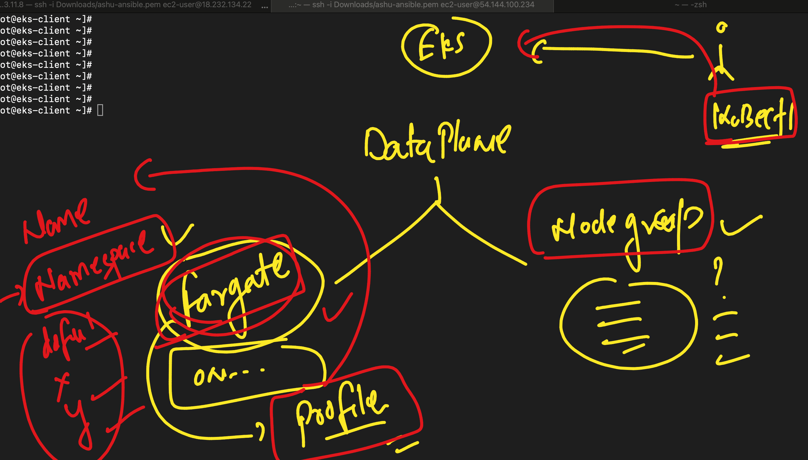

# devops_mastering -- Day 13

### connected to EKS 

### Creating and checking deployment 

```
[root@eks-client ~]# kubectl   create  deployment ashudep1 --image=nginx --port 80 
deployment.apps/ashudep1 created
[root@eks-client ~]# 
[root@eks-client ~]# kubectl  get  deploy
NAME       READY   UP-TO-DATE   AVAILABLE   AGE
ashudep1   1/1     1            1           6s
[root@eks-client ~]# 


```

### namespace in k8s 


### kube-system 

```
kubectl  get po  -n kube-system 
NAME                           READY   STATUS    RESTARTS   AGE
aws-node-dm8s7                 2/2     Running   0          44m
coredns-54d6f577c6-9v8w2       1/1     Running   0          71m
coredns-54d6f577c6-r5llj       1/1     Running   0          71m
eks-pod-identity-agent-4s6hr   1/1     Running   0          44m
kube-proxy-f7j9m               1/1     Running   0          44m

```

### Creating namespace 

```
root@eks-client ~]# kubectl   create  ns  ashu-space 
namespace/ashu-space created
[root@eks-client ~]# kubectl  get ns
NAME              STATUS   AGE
ashu-space        Active   4s
default           Active   74m
kube-node-lease   Active   74m
kube-public       Active   74m
kube-system       Active   74m
[root@eks-client ~]# 
[root@eks-client ~]# kubectl config set-context --current --namespace=ashu-space 
Context "arn:aws:eks:us-east-1:751136288263:cluster/eks-cluster" modified.
[root@eks-client ~]# 
[root@eks-client ~]# kubectl  get po 
No resources found in ashu-space namespace.
[root@eks-client ~]# 


```

### checking current namespace 

```
 kubectl  config get-contexts 
CURRENT   NAME                                                     CLUSTER                                                  AUTHINFO                                                 NAMESPACE
*         arn:aws:eks:us-east-1:751136288263:cluster/eks-cluster   arn:aws:eks:us-east-1:751136288263:cluster/eks-cluster   arn:aws:eks:us-east-1:751136288263:cluster/eks-cluster   ashu-space
```

### checking all namespace resources 

```
root@eks-client ~]# kubectl  get po -A
NAMESPACE     NAME                           READY   STATUS    RESTARTS   AGE
ashu-space    ashu1-657767fc67-79mrd         1/1     Running   0          7s
kube-system   aws-node-dm8s7                 2/2     Running   0          52m
kube-system   coredns-54d6f577c6-9v8w2       1/1     Running   0          79m
kube-system   coredns-54d6f577c6-r5llj       1/1     Running   0          79m
kube-system   eks-pod-identity-agent-4s6hr   1/1     Running   0          52m
kube-system   kube-proxy-f7j9m               1/1     Running   0          52m
[root@eks-client ~]# 
[root@eks-client ~]# 
[root@eks-client ~]# kubectl  get po --all-namespaces
NAMESPACE     NAME                           READY   STATUS    RESTARTS   AGE
ashu-space    ashu1-657767fc67-79mrd         1/1     Running   0          70s
kube-system   aws-node-dm8s7                 2/2     Running   0        
```

### fargate profile options 


## aws fargate 



