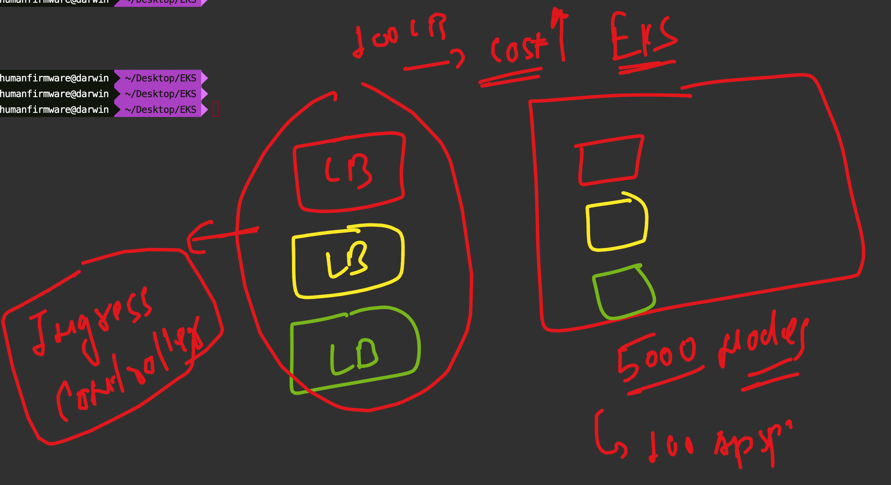
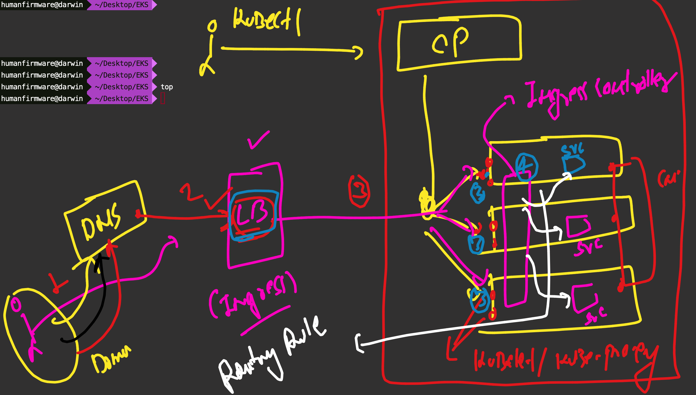

# devops_mastering -- Day 14 

### checking fargate nodes 

```
kubectl  get no
NAME                                     STATUS   ROLES    AGE     VERSION
fargate-ip-192-168-154-68.ec2.internal   Ready    <none>   3m48s   v1.29.0-eks-680e576
ip-192-168-47-211.ec2.internal           Ready    <none>   37m     v1.29.3-eks-ae9a62a
[root@eks-client ~]# 


```
## Introduction to Ingress controller 



## Understanding Ingress routing 




