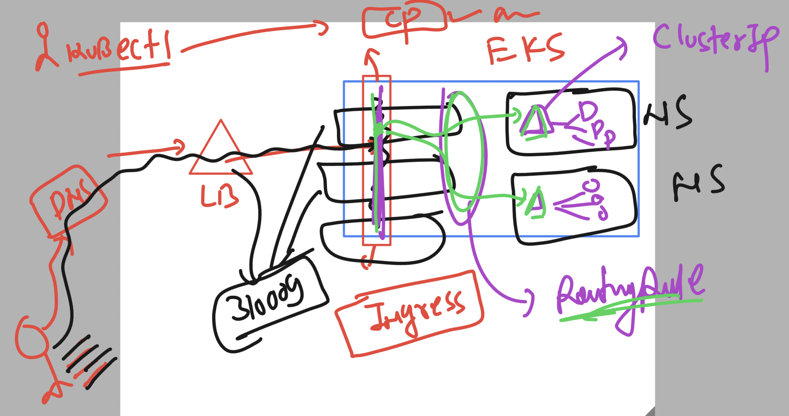
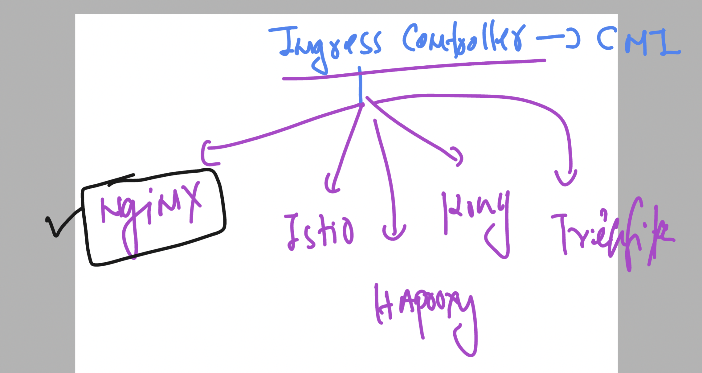

# devops_mastering -- day 15 

### Understanding ingress again 



### Creating Namespace 

```
root@eks-client ~]# kubectl create ns ashu-space 
namespace/ashu-space created
[root@eks-client ~]# kubectl config set-context --current --namespace ashu-space
Context "arn:aws:eks:us-east-1:751136288263:cluster/jpmc-cluster" modified.
[root@eks-client ~]# 
[root@eks-client ~]# 


```

### creating deployment 

```
[root@eks-client ~]# kubectl   create deployment  ashu-dep1 --image=nginx --port 80 
deployment.apps/ashu-dep1 created
[root@eks-client ~]# kubectl  scale deployment ashu-dep1 --replicas 2
deployment.apps/ashu-dep1 scaled
[root@eks-client ~]# kubectl  get po
NAME                        READY   STATUS    RESTARTS   AGE
ashu-dep1-9c8b4d864-5fklb   1/1     Running   0          30s
ashu-dep1-9c8b4d864-xzljj   1/1     Running   0          41s

```
### Creating Internal LB -- using ClusterIP type service 

```
[root@eks-client ~]# kubectl   expose deployment ashu-dep1 --type ClusterIP --port 80 --name ashulb1 
service/ashulb1 exposed
[root@eks-client ~]# kubectl  get svc
NAME      TYPE        CLUSTER-IP      EXTERNAL-IP   PORT(S)   AGE
ashulb1   ClusterIP   10.100.249.58   <none>        80/TCP    4s
[root@eks-client ~]# kubectl  get  ep 
NAME      ENDPOINTS                             AGE
ashulb1   192.168.47.156:80,192.168.49.171:80   9s
[root@eks-client ~]# 

```

## Nginx ingress controller deployment 




### setup 

```
root@eks-client ~]# kubectl apply -f https://raw.githubusercontent.com/kubernetes/ingress-nginx/main/deploy/static/provider/aws/deploy.yaml 
namespace/ingress-nginx created
serviceaccount/ingress-nginx created
serviceaccount/ingress-nginx-admission created
role.rbac.authorization.k8s.io/ingress-nginx created
role.rbac.authorization.k8s.io/ingress-nginx-admission created
clusterrole.rbac.authorization.k8s.io/ingress-nginx created
clusterrole.rbac.authorization.k8s.io/ingress-nginx-admission created
rolebinding.rbac.authorization.k8s.io/ingress-nginx created
rolebinding.rbac.authorization.k8s.io/ingress-nginx-admission created
clusterrolebinding.rbac.authorization.k8s.io/ingress-nginx created
clusterrolebinding.rbac.authorization.k8s.io/ingress-nginx-admission created
configmap/ingress-nginx-controller created
service/ingress-nginx-controller created
service/ingress-nginx-controller-admission created
deployment.apps/ingress-nginx-controller created
job.batch/ingress-nginx-admission-create created
job.batch/ingress-nginx-admission-patch created
ingressclass.networking.k8s.io/nginx created
validatingwebhookconfiguration.admissionregistration.k8s.io/ingress-nginx-admission created

```

### verify 

```
[root@eks-client ~]# kubectl   get  po -n ingress-nginx  
NAME                                        READY   STATUS      RESTARTS   AGE
ingress-nginx-admission-create-6zvv2        0/1     Completed   0          4m45s
ingress-nginx-admission-patch-tzlnr         0/1     Completed   0          4m45s
ingress-nginx-controller-57b7568757-fccld   1/1     Running     0          4m45s
[root@eks-client ~]# 
[root@eks-client ~]# 
[root@eks-client ~]# kubectl   get  svc  -n ingress-nginx  
NAME                                 TYPE           CLUSTER-IP       EXTERNAL-IP                                                                     PORT(S)                      AGE
ingress-nginx-controller             LoadBalancer   10.100.169.27    ae7783f5c161d4192b8eef6c82d676dd-0298945e6876e67f.elb.us-east-1.amazonaws.com   80:30910/TCP,443:31035/TCP   4m56s
ingress-nginx-controller-admission   ClusterIP      10.100.155.104   <none>                                                                          443/TCP                      4m56s
[root@eks-client ~]# 

```

### Creating ingress routing rule 

```
ot@eks-client ~]# kubectl   create -f ingress.yml 
ingress.networking.k8s.io/ashu-app-routing-rule created
[root@eks-client ~]# 
[root@eks-client ~]# kubectl  get ingress
NAME                    CLASS   HOSTS                    ADDRESS   PORTS   AGE
ashu-app-routing-rule   nginx   ashutoshh.adhocnet.org             80      6s
[root@eks-client ~]# 
[root@eks-client ~]# kubectl  get ingress
NAME                    CLASS   HOSTS                    ADDRESS   PORTS   AGE
ashu-app-routing-rule   nginx   ashutoshh.adhocnet.org             80      12s
[root@eks-client ~]# 


```

### Note: for official page 

[click_here](https://kubernetes.io/docs/concepts/services-networking/ingress/)

### verify again 

```
kubectl   get  deploy
NAME        READY   UP-TO-DATE   AVAILABLE   AGE
ashu-dep1   2/2     2            2           37m
[root@eks-client ~]# kubectl   get  po
NAME                        READY   STATUS    RESTARTS   AGE
ashu-dep1-9c8b4d864-5fklb   1/1     Running   0          37m
ashu-dep1-9c8b4d864-xzljj   1/1     Running   0          37m
[root@eks-client ~]# 
[root@eks-client ~]# kubectl   get  svc
NAME      TYPE        CLUSTER-IP      EXTERNAL-IP   PORT(S)   AGE
ashulb1   ClusterIP   10.100.249.58   <none>        80/TCP    33m
[root@eks-client ~]# 
[root@eks-client ~]# kubectl   get  ing
NAME                    CLASS   HOSTS                    ADDRESS                                                                         PORTS   AGE
ashu-app-routing-rule   nginx   ashutoshh.adhocnet.org   ae7783f5c161d4192b8eef6c82d676dd-0298945e6876e67f.elb.us-east-1.amazonaws.com   80      100s
[root@eks-client ~]# 


```

