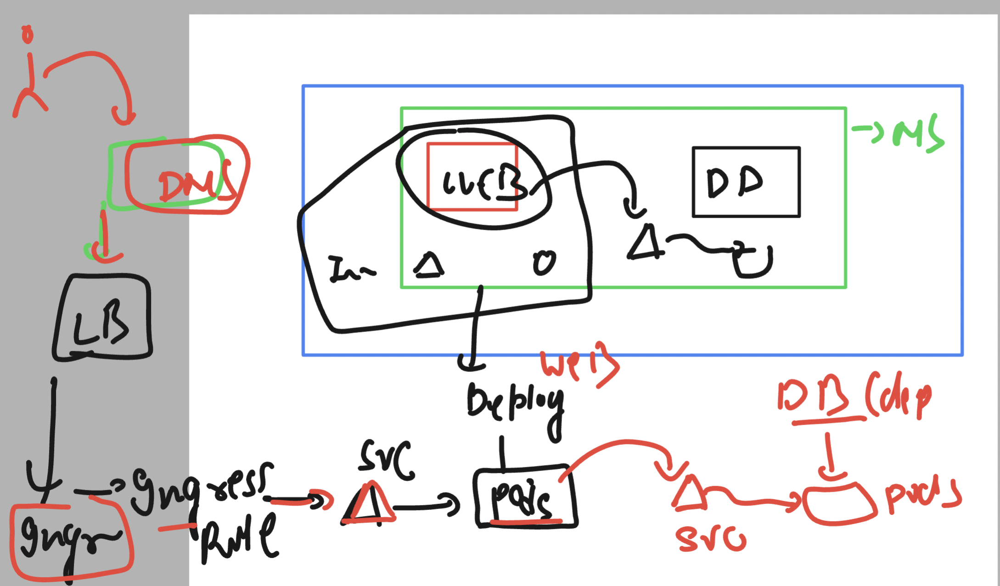
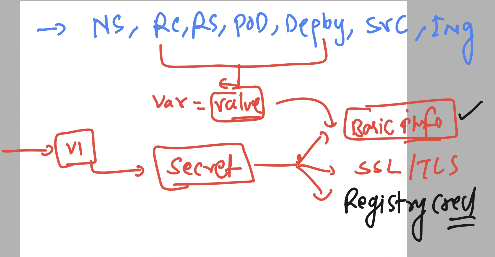
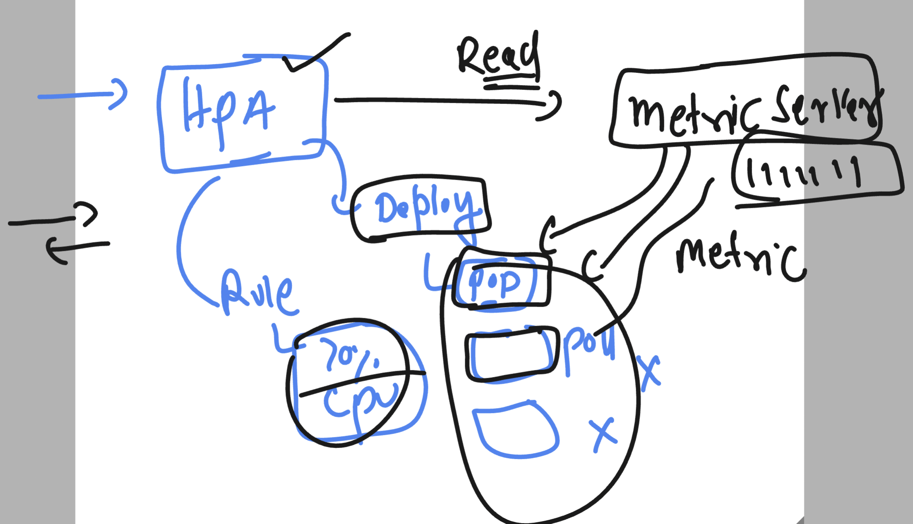

# devops_mastering  -- Day 16 

### Deploy two tier app in k8s 



## Creating Db deployment manifest

```
kubectl  create deployment  ashudb --image mysql --port 3306 --dry-run=client -o yaml  >db_deploy.yml
```

### DBfile edited with ENV

```
apiVersion: apps/v1
kind: Deployment
metadata:
  creationTimestamp: null
  labels:
    app: ashudb
  name: ashudb
spec:
  replicas: 1
  selector:
    matchLabels:
      app: ashudb
  strategy: {}
  template:
    metadata:
      creationTimestamp: null
      labels:
        app: ashudb
    spec:
      containers:
      - image: mysql
        name: mysql
        ports:
        - containerPort: 3306
        resources: {}
        env: 
        - name: MYSQL_ROOT_PASSWORD
          value: Redhat@098
        - name: MYSQL_DATABASE
          value: ashudb-new
```

## rather than storing password or any confidential details in manifest we can use -- Secret 



### Creating it 

```
[root@eks-client web2t]# kubectl create secret generic  ashu-db-cred  --from-literal  mypass="Redhat@098" --dry-run=client -o yaml  >rootcred.yaml 
[root@eks-client web2t]# ls
db_deploy.yml  rootcred.yaml
[root@eks-client web2t]# kubectl create -f rootcred.yaml 
secret/ashu-db-cred created
[root@eks-client web2t]# kubectl  get secrets 
NAME           TYPE     DATA   AGE
ashu-db-cred   Opaque   1      5s

```

### we can read data from file also in secret 

```
kubectl create secret generic ashu-db-cred-new --from-file info.txt --dry-run=client -o yaml   >secret-file.yml
```

### file -- info.txt

```
MYSQL_USER=ashu
MYSQL_PASSWORD=hhuu8877
MYSQL_ROOT_PASSWORD=Redhat@098
MYSQL_DATABASE=ashudb
```
### -- using in deployment_manifest

```
apiVersion: apps/v1
kind: Deployment
metadata:
  creationTimestamp: null
  labels:
    app: ashudb
  name: ashudb
spec:
  replicas: 1
  selector:
    matchLabels:
      app: ashudb
  strategy: {}
  template:
    metadata:
      creationTimestamp: null
      labels:
        app: ashudb
    spec:
      containers:
      - image: mysql
        name: mysql
        ports:
        - containerPort: 3306
        resources: {}
        envFrom:
        - secretRef:
           name: ashu-db-cred-new 
status: {}

```

### now we can deploy db with secret 

```
[root@eks-client web2t]# kubectl  get deploy
NAME     READY   UP-TO-DATE   AVAILABLE   AGE
ashudb   1/1     1            1           7s
[root@eks-client web2t]# kubectl get secrets 
NAME               TYPE     DATA   AGE
ashu-db-cred       Opaque   1      16m
ashu-db-cred-new   Opaque   1      6m7s
[root@eks-client web2t]# kubectl get po 
NAME                      READY   STATUS    RESTARTS   AGE
ashudb-5ff578d976-db874   1/1     Running   0          20s
[root@eks-client web2t]# kubectl  logs ashudb-5ff578d976-db874 
2024-05-04 04:45:48+00:00 [Note] [Entrypoint]: Entrypoint script 
```

### Creating clusterIP for mysql db deployment

```
[root@eks-client web2t]# kubectl  get deploy 
NAME     READY   UP-TO-DATE   AVAILABLE   AGE
ashudb   1/1     1            1           2m7s
[root@eks-client web2t]# 
[root@eks-client web2t]# kubectl  expose deployment ashudb --port 3306  --name ashudb-lb 
service/ashudb-lb exposed
[root@eks-client web2t]# kubectl  get svc
NAME        TYPE        CLUSTER-IP      EXTERNAL-IP   PORT(S)    AGE
ashudb-lb   ClusterIP   10.100.159.68   <none>        3306/TCP   3s
[root@eks-client web2t]# kubectl  get  po 
NAME                      READY   STATUS    RESTARTS   AGE
ashudb-5ff578d976-db874   1/1     Running   0          2m39s
[root@eks-client web2t]# kubectl  get  ep
NAME        ENDPOINTS             AGE
ashudb-lb   192.168.61.175:3306   14s
[root@eks-client web2t]# 

```

### creating webapp

```
[root@eks-client web2t]# kubectl create deployment ashu-web  --image adminer  --port 8080 --dry-run=client -o yaml >web.yaml
[root@eks-client web2t]# ls
db_deploy.yml  db_deploy_new.yml  info.txt  rootcred.yaml  secret-file.yml  web.yaml
[root@eks-client web2t]# kubectl create -f web.yaml 
deployment.apps/ashu-web created
[root@eks-client web2t]# kubectl  get  deploy
NAME       READY   UP-TO-DATE   AVAILABLE   AGE
ashu-web   0/1     1            0           6s
ashudb     1/1     1            1           6m24s
[root@eks-client web2t]# 

```

### creating internal LB for webapp

```
[root@eks-client web2t]# kubectl get deploy
NAME       READY   UP-TO-DATE   AVAILABLE   AGE
ashu-web   1/1     1            1           88s
ashudb     1/1     1            1           7m46s
[root@eks-client web2t]# kubectl expose deployment ashu-web --type ClusterIP  --port 8080 --name ashuweb-lb 
service/ashuweb-lb exposed
[root@eks-client web2t]# kubectl  get svc
NAME         TYPE        CLUSTER-IP      EXTERNAL-IP   PORT(S)    AGE
ashudb-lb    ClusterIP   10.100.159.68   <none>        3306/TCP   7m35s
ashuweb-lb   ClusterIP   10.100.4.143    <none>        8080/TCP   4s
[root@eks-client web2t]# kubectl  get  ep 
NAME         ENDPOINTS             AGE
ashudb-lb    192.168.61.175:3306   7m44s
ashuweb-lb   192.168.49.171:8080   13s
```

### deploy ingress for web app

```
apiVersion: networking.k8s.io/v1
kind: Ingress
metadata:
  name: ashu-app-routing-rule # name of rule 
  annotations:
    nginx.ingress.kubernetes.io/rewrite-target: /
spec:
  ingressClassName: nginx # class name 
  rules:
  - host: ashutoshh.adhocnet.org 
    http:
      paths:
      - path: / # home page 
        pathType: Prefix
        backend:
          service:
            name: ashuweb-lb
            port:
              number: 8080

```

### creating ingress rule using kubectl 

```
kubectl create -f ingress.yml 
```


### we directly create 

```
root@eks-client ~]# kubectl delete -f  web2t/
deployment.apps "ashudb" deleted
service "ashudb-lb" deleted
ingress.networking.k8s.io "ashu-app-routing-rule" deleted
secret "ashu-db-cred" deleted
deployment.apps "ashu-web" deleted
service "ashuweb-lb" deleted
[root@eks-client ~]# 
[root@eks-client ~]# 
[root@eks-client ~]# kubectl create  -f  web2t/
deployment.apps/ashudb created
service/ashudb-lb created
ingress.networking.k8s.io/ashu-app-routing-rule created
secret/ashu-db-cred created
deployment.apps/ashu-web created
service/ashuweb-lb created

```

### HPA in K8s 



### Installing metric server in EKS 

```
 kubectl apply -f https://github.com/kubernetes-sigs/metrics-server/releases/latest/download/components.yaml
serviceaccount/metrics-server created
clusterrole.rbac.authorization.k8s.io/system:aggregated-metrics-reader created
clusterrole.rbac.authorization.k8s.io/system:metrics-server created
rolebinding.rbac.authorization.k8s.io/metrics-server-auth-reader created
clusterrolebinding.rbac.authorization.k8s.io/metrics-server:system:auth-delegator created
clusterrolebinding.rbac.authorization.k8s.io/system:metrics-server created
service/metrics-server created
deployment.apps/metrics-server created
apiservice.apiregistration.k8s.io/v1beta1.metrics.k8s.io created
[root@eks-client ~]# 
[root@eks-client ~]# kubectl  get po -n kube-system 
NAME                              READY   STATUS    RESTARTS   AGE
aws-node-l55lq                    2/2     Running   0          15h
coredns-54d6f577c6-rtwx4          1/1     Running   0          16h
coredns-54d6f577c6-w9qjs          1/1     Running   0          16h
kube-proxy-lgdbx                  1/1     Running   0          15h
metrics-server-6d94bc8694-6s7kw   0/1     Running   0          11s
[root@eks-client ~]# kubectl  get po -n kube-system 
NAME                              READY   STATUS    RESTARTS   AGE
aws-node-l55lq                    2/2     Running   0          15h
coredns-54d6f577c6-rtwx4          1/1     Running   0          16h
coredns-54d6f577c6-w9qjs          1/1     Running   0          16h
kube-proxy-lgdbx                  1/1     Running   0          15h
metrics-server-6d94bc8694-6s7kw   0/1     Running   0          18s
```

### verify 

```
oot@eks-client ~]# kubectl  get po 
NAME                        READY   STATUS    RESTARTS   AGE
ashu-web-54c5c88f98-gb4pr   1/1     Running   0          13m
ashudb-5ff578d976-2bnbs     1/1     Running   0          13m
[root@eks-client ~]# kubectl  top   pod  ashu-web-54c5c88f98-gb4pr 
NAME                        CPU(cores)   MEMORY(bytes)   
ashu-web-54c5c88f98-gb4pr   1m           14Mi            
[root@eks-client ~]# 
```

### top can only be used with node and pod

```
root@eks-client ~]# kubectl  get po 
NAME                        READY   STATUS    RESTARTS   AGE
ashu-web-54c5c88f98-gb4pr   1/1     Running   0          13m
ashudb-5ff578d976-2bnbs     1/1     Running   0          13m
[root@eks-client ~]# kubectl  top   pod  ashu-web-54c5c88f98-gb4pr 
NAME                        CPU(cores)   MEMORY(bytes)   
ashu-web-54c5c88f98-gb4pr   1m           14Mi            
[root@eks-client ~]# 
[root@eks-client ~]# kubectl  get no
NAME                             STATUS   ROLES    AGE   VERSION
ip-192-168-58-246.ec2.internal   Ready    <none>   15h   v1.29.3-eks-ae9a62a
[root@eks-client ~]# kubectl  top node ip-192-168-58-246.ec2.internal 
NAME                             CPU(cores)   CPU%   MEMORY(bytes)   MEMORY%   
ip-192-168-58-246.ec2.internal   42m          2%     1321Mi          39%       
[root@eks-client ~]# 


```

### limiting web pod 

```
apiVersion: apps/v1
kind: Deployment
metadata:
  creationTimestamp: null
  labels:
    app: ashu-web
  name: ashu-web
spec:
  replicas: 1
  selector:
    matchLabels:
      app: ashu-web
  strategy: {}
  template:
    metadata:
      creationTimestamp: null
      labels:
        app: ashu-web
    spec:
      containers:
      - image: adminer
        name: adminer
        ports:
        - containerPort: 8080
        resources:  # by default pod can use all the resources of the node 
         requests:
           memory: 50M 
           cpu: 30m  #  1 vcpu === 1000m mili core 
         limits:
           memory: 150M 
           cpu: 100m

```

### writing HPA rule 

```
[root@eks-client web2t]# kubectl  get deploy
NAME       READY   UP-TO-DATE   AVAILABLE   AGE
ashu-web   1/1     1            1           24m
ashudb     1/1     1            1           24m
[root@eks-client web2t]# 
[root@eks-client web2t]# 
[root@eks-client web2t]# kubectl  autoscale deployment ashu-web  --min 2 --max 10 --cpu-percent  40 --dru-run=client -o yaml >hpa.yml
error: unknown flag: --dru-run
See 'kubectl autoscale --help' for usage.
[root@eks-client web2t]# kubectl  autoscale deployment ashu-web  --min 2 --max 10 --cpu-percent  40 --dry-run=client -o yaml >hpa.yml
[root@eks-client web2t]# 
[root@eks-client web2t]# kubectl create -f hpa.yml 
horizontalpodautoscaler.autoscaling/ashu-web created
[root@eks-client web2t]# kubectl  get hpa
NAME       REFERENCE             TARGETS         MINPODS   MAXPODS   REPLICAS   AGE
ashu-web   Deployment/ashu-web   <unknown>/40%   2         10        0          4s
[root@eks-client web2t]# kubectl  get po 
NAME                        READY   STATUS    RESTARTS   AGE
ashu-web-596d947568-qt5mx   1/1     Running   0          2m56s
ashu-web-596d947568-qw4m4   1/1     Running   0          5s
ashudb-5ff578d976-2bnbs     1/1     Running   0          25m

```