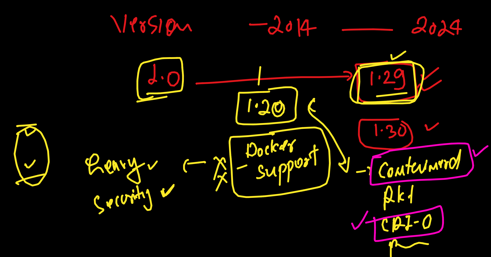

# devops_mastering

### K8s setup options 


### setup control plane and data plane -- 

[click_here](https://www.youtube.com/watch?v=TTzbQdu30YA)

### Rancher Desktop 

[click_here](https://www.youtube.com/watch?v=MwwF-dWtEAk&t=1s)


### MORE on k8s 


## Kubernetes version history 




### to check kubectl version 

```
kubectl   version --client  
Client Version: v1.29.1
Kustomize Version: v5.0.4-0.20230601165947-6ce0bf390ce3
```

### how to check number of nodes 

```
 kubectl   get  nodes
NAME                   STATUS   ROLES                  AGE     VERSION
lima-rancher-desktop   Ready    control-plane,master   4m36s   v1.29.3+k3s1
➜  ~ 

```


