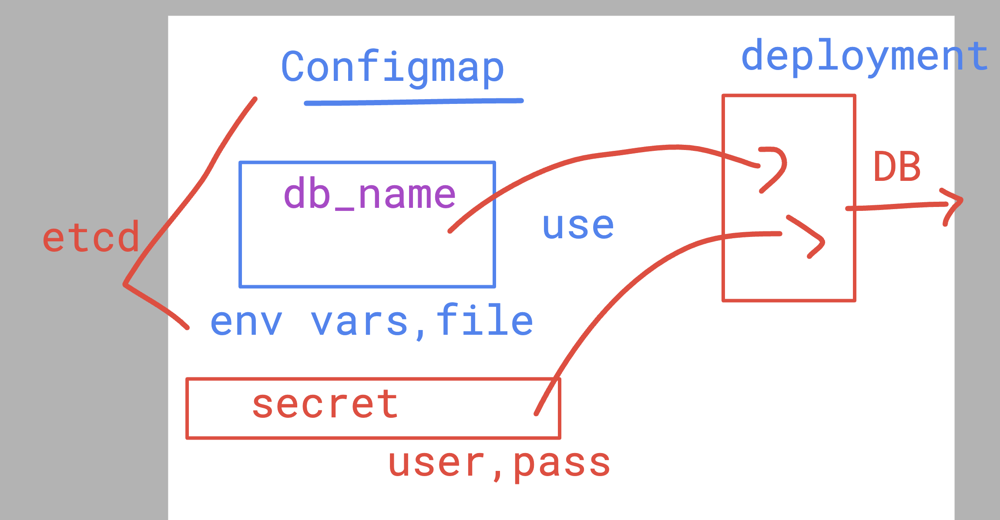

# devops_mastering 

## Notes 

### killercoda 
[click_to_access](https://killercoda.com/)

### kodeCloud 

[click_to_access](https://kodekloud.com/)

## AKS cred download

```
1518  az login
 1519  az account set --subscription 303b3b2d-b7b5-478d-9a25-29ef3926e56a
 1520  az aks get-credentials --resource-group ashu-resources-grp --name ashu-k8s --overwrite-existing
```
### Creating namespace --

```
humanfirmware@darwin  ~/Desktop  kubectl  get nodes
NAME                                STATUS   ROLES   AGE   VERSION
aks-agentpool-13361198-vmss000002   Ready    agent   43m   v1.28.9
aks-agentpool-13361198-vmss000003   Ready    agent   43m   v1.28.9
 humanfirmware@darwin  ~/Desktop  kubectl get ns
NAME              STATUS   AGE
default           Active   23h
kube-node-lease   Active   23h
kube-public       Active   23h
kube-system       Active   23h
 humanfirmware@darwin  ~/Desktop  kubectl  create  ns  ashu-project
namespace/ashu-project created
 humanfirmware@darwin  ~/Desktop  kubectl  config set-context --current --namespace ashu-project
Context "ashu-k8s" modified.
 humanfirmware@darwin  ~/Desktop  kubectl get po 
No resources found in ashu-project namespace.
 humanfirmware@darwin  ~/Desktop  

```

## Understanding CM & secret to use in Deployment as ENV variables 




### case 1 for secret command 

```
kubectl create secret generic ashu-db-general-cred --from-l
iteral MYSQL_USER=ashu --from-literal MYSQL_PASSWORD=Redhatashu@123 --dry-run=client -o yaml >useenvas-key.yml
```

### final Mysql pod -- using deployment with CM & secret

```
humanfirmware@darwin  ~/devops_mastering/k8s/manifests   master  ls
cm_dbname.yml         db-users.txt          rootsecret.yml
cm_deploy.yml         dbsecret-fromfile.yml useenvas-key.yml
 humanfirmware@darwin  ~/devops_mastering/k8s/manifests   master  
 humanfirmware@darwin  ~/devops_mastering/k8s/manifests   master  kubectl apply -f cm_dbname.yml -f rootse
cret.yml -f useenvas-key.yml -f cm_deploy.yml 
configmap/ashu-db-name created
secret/ashu-root-cred created
secret/ashu-db-general-cred created
deployment.apps/mohit-db created
 humanfirmware@darwin  ~/devops_mastering/k8s/manifests   master  kubectl get cm
NAME               DATA   AGE
ashu-db-name       1      11s
kube-root-ca.crt   1      34m
 humanfirmware@darwin  ~/devops_mastering/k8s/manifests   master  kubectl get secret
NAME                   TYPE     DATA   AGE
ashu-db-general-cred   Opaque   2      13s
ashu-root-cred         Opaque   1      14s
 humanfirmware@darwin  ~/devops_mastering/k8s/manifests   master  kubectl get deploy
NAME       READY   UP-TO-DATE   AVAILABLE   AGE
mohit-db   1/1     1            1           23s
 humanfirmware@darwin  ~/devops_mastering/k8s/manifests   master  


```

### History for cm & secret

```
 1535  mkdir manifests
 1536  ls
 1537  kubectl create deployment ashu-app --image=dockerashu/ashu-customer:bmoappv1  --port 80 --dry-run=client -o yaml >cm_deploy.yml
 1538  kubectl  create  deploy mohit-db --image=mysql --port 3306   --dry-run=client -o yaml >cm_deploy.yml
 1539  kubectl  create configmap ashu-db-name --from-literal mydb_name=ashuempdb --dry-run=client -o yaml >cm_dbname.yml
 1540  history
 1541  kubectl  create secret 
 1542  kubectl  create secret  generic ashu-root-cred --from-literal mydbroot_pass=Redhat@12345 --dry-run=client -o yaml >rootsecret.yml
 1543  kubectl create secret generic ashu-db-general-cred --from-literal MYSQL_USER=ashu --from-literal MYSQL_PASSWORD=Redhatashu@123 --dry-run=client -o yaml >useenvas-key.yml
 1544  history
 1545  kubectl create secret generic ashu-db-general-cred-fromfile   --from-file db-users.txt --dry-run=client -o yaml >dbsecret-fromfile.yml
 1546* kubectl explain pod.spec.containers.envFrom
 1547  ls
 1548  kubectl apply -f cm_dbname.yml -f rootsecret.yml -f useenvas-key.yml -f cm_deploy.yml
 1549  kubectl get cm
 1550  kubectl get secret
 1551  kubectl get deploy
```