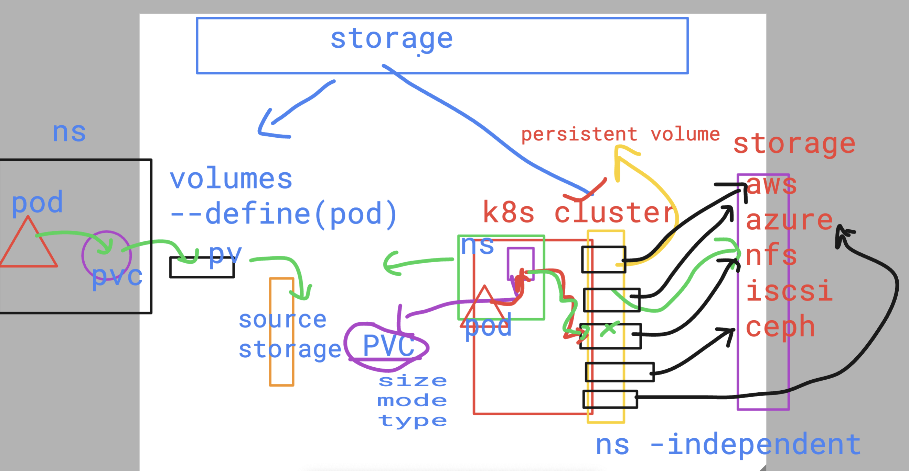

# devops_mastering 

## Notes 

### killercoda 
[click_to_access](https://killercoda.com/)

### kodeCloud 

[click_to_access](https://kodekloud.com/)

## Understanding PV & PVC 



### checking pv

```
umanfirmware@darwin  ~  kubectl get pv
NAME        CAPACITY   ACCESS MODES   RECLAIM POLICY   STATUS      CLAIM   STORAGECLASS   VOLUMEATTRIBUTESCLASS   REASON   AGE
ashu-pv     1Gi        RWO            Retain           Available           manual         <unset>                          3m47s
ashu-pv-2   2Gi        RWO            Retain           Available           manual         <unset>                          66s
 humanfirmware@darwin  ~  

```
### pvc

```
 humanfirmware@darwin  ~/devops_mastering/k8s/day21   master ±  kubectl create -f myapppvc.yml 
persistentvolumeclaim/ashu-pvc-1 created
 humanfirmware@darwin  ~/devops_mastering/k8s/day21   master ±  kubectl  get  pvc
NAME         STATUS    VOLUME   CAPACITY   ACCESS MODES   STORAGECLASS   VOLUMEATTRIBUTESCLASS   AGE
ashu-pvc-1   Pending                                      manual         <unset>                 5s
 humanfirmware@darwin  ~/devops_mastering/k8s/day21   master ±  kubectl replace -f myapppvc.yml --force 
persistentvolumeclaim "ashu-pvc-1" deleted
persistentvolumeclaim/ashu-pvc-1 replaced
 humanfirmware@darwin  ~/devops_mastering/k8s/day21   master ±  kubectl get pvc
NAME         STATUS   VOLUME    CAPACITY   ACCESS MODES   STORAGECLASS   VOLUMEATTRIBUTESCLASS   AGE
ashu-pvc-1   Bound    ashu-pv   1Gi        RWO            manual         <unset>                 5s
 humanfirmware@darwin  ~/devops_mastering/k8s/day21   master ±  

```

