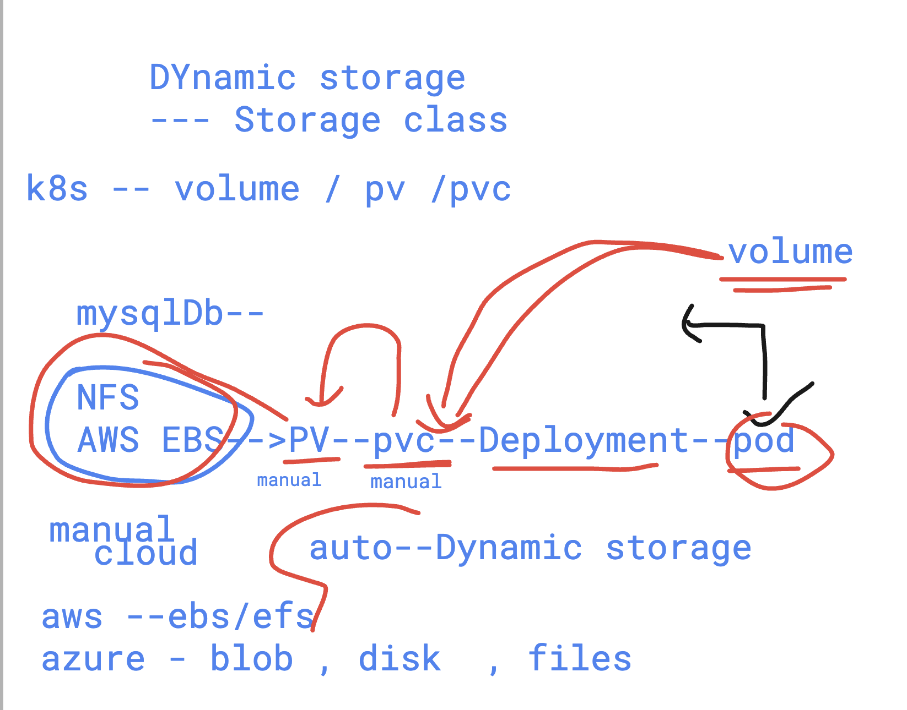

# devops_mastering 

## Notes 

### killercoda 
[click_to_access](https://killercoda.com/)

### kodeCloud 

[click_to_access](https://kodekloud.com/)

### helm Repo for commands 
[access_here](https://github.com/redashu/k8s/tree/helm)


## Helm Understanding 


### helm v2 & v3


### checking helm version and adding repo 

```
 humanfirmware@darwin  ~/Desktop  helm version 
version.BuildInfo{Version:"v3.13.3", GitCommit:"c8b948945e52abba22ff885446a1486cb5fd3474", GitTreeState:"clean", GoVersion:"go1.20.11"}
 humanfirmware@darwin  ~/Desktop  kubectl version --client 
Client Version: v1.30.0
Kustomize Version: v5.0.4-0.20230601165947-6ce0bf390ce3
 humanfirmware@darwin  ~/Desktop  which helm
/Users/humanfirmware/.rd/bin/helm
 humanfirmware@darwin  ~/Desktop  helm repo add ashu-devopstech  https://charts.bitnami.com/bitnami 
"ashu-devopstech" has been added to your repositories
 humanfirmware@darwin  ~/Desktop  


```

### listing repo 

```
humanfirmware@darwin  ~/Desktop  helm repo ls
NAME                	URL                                                     
prometheus-community	https://prometheus-community.github.io/helm-charts      
stable              	https://charts.helm.sh/stable                           
elastic             	https://helm.elastic.co                                 
prometheus-msteams  	https://prometheus-msteams.github.io/prometheus-msteams/
ingress-nginx       	https://kubernetes.github.io/ingress-nginx              
eks                 	https://aws.github.io/eks-charts                        
grafana             	https://grafana.github.io/helm-charts                   
dasmeta-adot        	https://dasmeta.github.io/aws-otel-helm-charts          
ashu-nginx-chart    	https://redashu.github.io/test-helm/                    
datadog             	https://helm.datadoghq.com                              
ashu-repo           	https://charts.bitnami.com/bitnami                      
kubernetes-dashboard	https://kubernetes.github.io/dashboard/                 
ashu-new-repo       	https://charts.bitnami.com/bitnami                      
ashu-devopstech     	https://charts.bitnami.com/bitnami             
```

## search in helm repo 

```
humanfirmware@darwin  ~/Desktop  helm search repo nginx                 
NAME                                          	CHART VERSION	APP VERSION	DESCRIPTION                                       
ashu-devopstech/nginx                         	17.3.0       	1.26.0     	NGINX Open Source is a web server that can be a...
ashu-devopstech/nginx-ingress-controller      	11.3.0       	1.10.1     	NGINX Ingress Controller is an Ingress controll...
ashu-devopstech/nginx-intel                   	2.1.15       	0.4.9      	DEPRECATED NGINX Open Source for Intel is a lig...
ashu-nginx-chart/nginx                        	0.1.0        	1.16.0     	A Helm chart for Kubernetes                       
```

### deploy package using helm 

```
humanfirmware@darwin  ~/Desktop  helm install  ashu-webapp  ashu-devopstech/nginx 
NAME: ashu-webapp
LAST DEPLOYED: Sat May 25 10:00:58 2024
NAMESPACE: default
STATUS: deployed
REVISION: 1
TEST SUITE: None

```

### checking currently deployed package

```
humanfirmware@darwin  ~/Desktop  helm  ls
NAME       	NAMESPACE	REVISION	UPDATED                             	STATUS  	CHART       	APP VERSION
ashu-webapp	default  	1       	2024-05-25 10:00:58.669564 +0530 IST	deployed	nginx-17.3.0	1.26.0     
 humanfirmware@darwin  ~/Desktop  


```

### uninstall 

```
humanfirmware@darwin  ~/Desktop  helm ls
NAME       	NAMESPACE	REVISION	UPDATED                             	STATUS  	CHART       	APP VERSION
ashu-webapp	default  	1       	2024-05-25 10:00:58.669564 +0530 IST	deployed	nginx-17.3.0	1.26.0     
 humanfirmware@darwin  ~/Desktop  helm uninstall ashu-webapp
release "ashu-webapp" uninstalled
 humanfirmware@darwin  ~/Desktop  helm ls                   
NAME	NAMESPACE	REVISION	UPDATED	STATUS	CHART	APP VERSION
 humanfirmware@darwin  ~/Desktop  kubectl get  deploy
No resources found in default namespace.
 humanfirmware@darwin  ~/Desktop  kubectl get  svc   
NAME         TYPE        CLUSTER-IP   EXTERNAL-IP   PORT(S)   AGE
kubernetes   ClusterIP   10.43.0.1    <none>        443/TCP   41m
 humanfirmware@darwin  ~/Desktop  

```

## Addressing storage workflow in k8s


### dynamic provision 



## creating storage class to create dynamic storage


### checking storage 

```
humanfirmware@darwin  ~/Desktop  kubectl  get  storageclass 
NAME                    PROVISIONER          RECLAIMPOLICY   VOLUMEBINDINGMODE      ALLOWVOLUMEEXPANSION   AGE
azurefile               file.csi.azure.com   Delete          Immediate              true                   70m
azurefile-csi           file.csi.azure.com   Delete          Immediate              true                   70m
azurefile-csi-premium   file.csi.azure.com   Delete          Immediate              true                   70m
azurefile-premium       file.csi.azure.com   Delete          Immediate              true                   70m
default (default)       disk.csi.azure.com   Delete          WaitForFirstConsumer   true                   70m
managed                 disk.csi.azure.com   Delete          WaitForFirstConsumer   true                   70m
managed-csi             disk.csi.azure.com   Delete          WaitForFirstConsumer   true                   70m
managed-csi-premium     disk.csi.azure.com   Delete          WaitForFirstConsumer   true                   70m
managed-premium         disk.csi.azure.com   Delete          WaitForFirstConsumer   true                   70m
 humanfirmware@darwin  ~/Desktop  
 humanfirmware@darwin  ~/Desktop  kubectl  config get-contexts
kCURRENT   NAME              CLUSTER           AUTHINFO                                     NAMESPACE
*         ashu-k8s          ashu-k8s          clusterUser_ashu-manual-eurogroup_ashu-k8s   
          rancher-desktop   rancher-desktop   rancher-desktop                              
 humanfirmware@darwin  ~/Desktop  kubectl config use-context rancher-desktop
Switched to context "rancher-desktop".
 humanfirmware@darwin  ~/Desktop  
 humanfirmware@darwin  ~/Desktop  kubectl  get  sc
NAME                   PROVISIONER             RECLAIMPOLICY   VOLUMEBINDINGMODE      ALLOWVOLUMEEXPANSION   AGE
local-path (default)   rancher.io/local-path   Delete          WaitForFirstConsumer   false                  38d
 humanfirmware@darwin  ~/Desktop  


```

