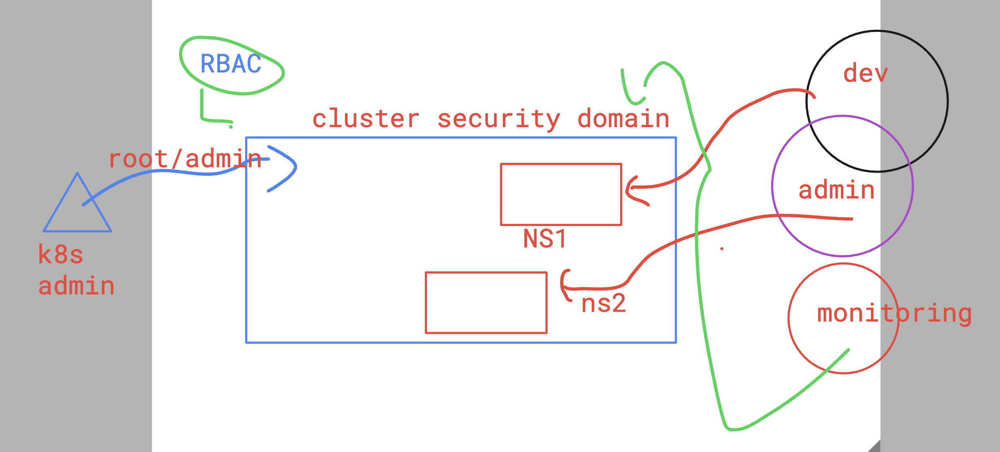
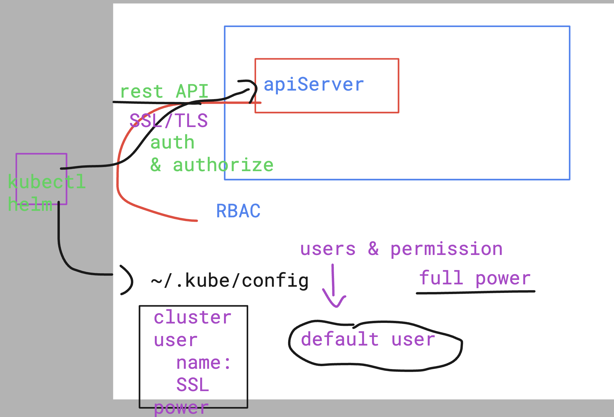
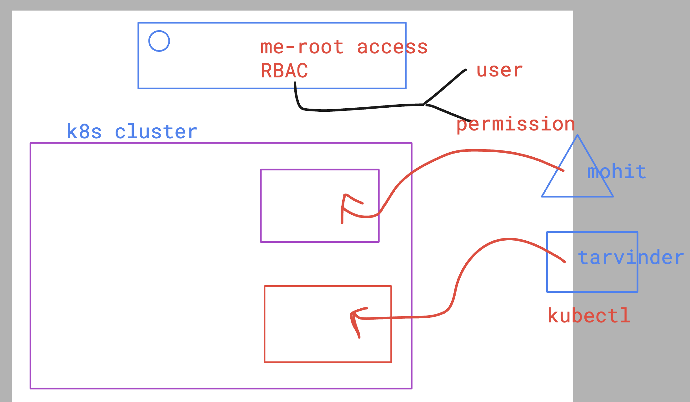
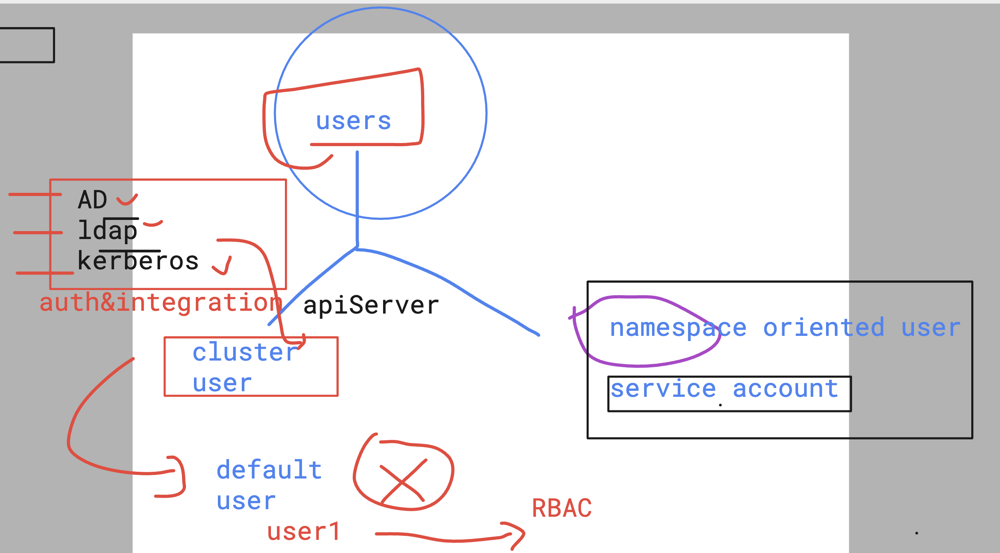

# devops_mastering 

## Notes 

### killercoda 
[click_to_access](https://killercoda.com/)

### kodeCloud 

[click_to_access](https://kodekloud.com/)

## RBAC 
### Understanding cluster security 



### How Kubectl send detials to APiserver




### checking kubeconfig file 

```
kubectl  config view
apiVersion: v1
clusters:
- cluster:
    certificate-authority-data: DATA+OMITTED
    server: https://127.0.0.1:6443
  name: rancher-desktop
contexts:
- context:
    cluster: rancher-desktop
    user: rancher-desktop
  name: rancher-desktop
current-context: rancher-desktop
kind: Config
preferences: {}
users:
- name: rancher-desktop
  user:
    client-certificate-data: DATA+OMITTED
    client-key-data: DATA+OMITTED
 humanfirmware@darwin  ~  kubectl  config view --raw
apiVersion: v1
clusters:
- cluster:
    certificate-authority-data: LS0tLS1CRUdJTiBDRVJUSUZJQ0FURS0tLS0tCk1JSUJkakNDQVIyZ0F3SUJBZ0lCQURBS0JnZ3Foa2pPUFFRREFqQWpNU0V3SHdZRFZRUUREQmhyTTNNdGMyVnkKZG1WeUxXTmhRREUzTVRNeU56YzNOalV3SGhjTk1qUXdOREUyTVRReU9USTFXaGNOTXpRd05ERTBNVFF5T1RJMQpXakFqTVNFd0h3WURWUVFEREJock0zTXRjMlZ5ZG1WeUxXTmhRREUzTVRNeU56YzNOalV3V1RBVEJnY3Foa2pPClBRSUJCZ2dxaGtqT1BRTUJCd05DQUFTYjdvV3A5SkNZeWFsWkVwc
```

### creating custom creds for users in k8s 



### general user vs service account 



### creating service account 

```
humanfirmware@darwin  ~  kubectl  get ns
NAME              STATUS   AGE
kube-system       Active   40d
kube-public       Active   40d
kube-node-lease   Active   40d
default           Active   40d
 humanfirmware@darwin  ~  
 humanfirmware@darwin  ~  kubectl  get  serviceaccount  
NAME      SECRETS   AGE
default   0         40d
 humanfirmware@darwin  ~  kubectl  create  ns  ashu-space
namespace/ashu-space created
 humanfirmware@darwin  ~  
 humanfirmware@darwin  ~  
 humanfirmware@darwin  ~  kubectl  get  sa  -n  ashu-space 
NAME      SECRETS   AGE
default   0         9s
 humanfirmware@darwin  ~  
 humanfirmware@darwin  ~  kubectl  create  sa  ashu-sa   -n  ashu-space 
serviceaccount/ashu-sa created
 humanfirmware@darwin  ~  kubectl  get  sa  -n  ashu-space              
NAME      SECRETS   AGE
default   0         34s
ashu-sa   0         1s

```

