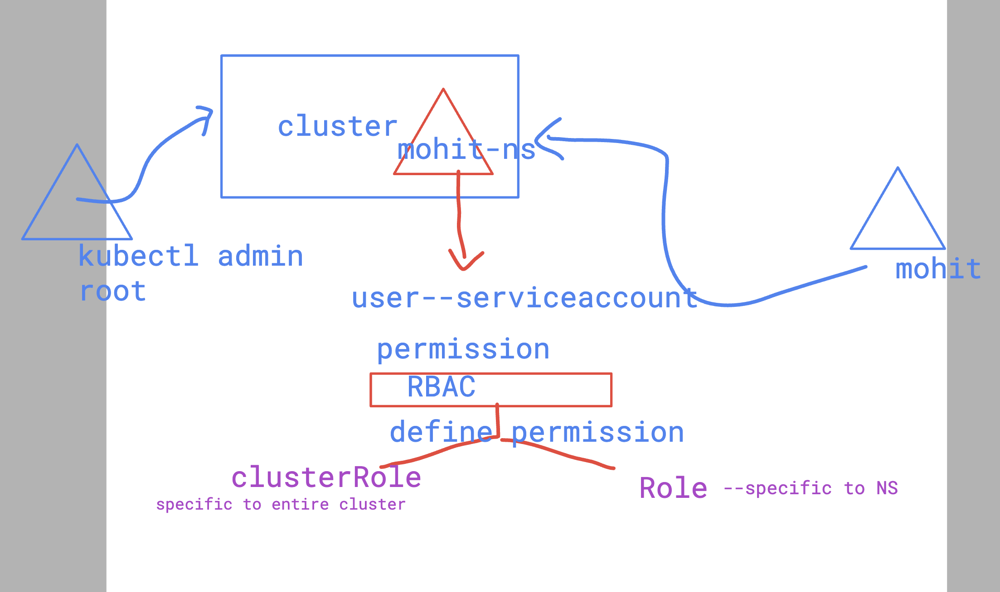

# devops_mastering 

## Notes 

### killercoda 
[click_to_access](https://killercoda.com/)

### kodeCloud 

[click_to_access](https://kodekloud.com/)

### checking service account 

```
humanfirmware@darwin  ~  kubectl create ns mohit-ns 
namespace/mohit-ns created

 humanfirmware@darwin  ~  kubectl get ns
NAME              STATUS   AGE
kube-system       Active   41d
kube-public       Active   41d
kube-node-lease   Active   41d
default           Active   41d
mohit-ns          Active   3s

 humanfirmware@darwin  ~  kubectl get sa -n mohit-ns 
NAME      SECRETS   AGE
default   0         7s

```

### defining permission with RBAC 



### Creating role for pod access with readonly permission 

```
kubectl create role mohit-role1  --verb=get,list,watch --resource=pods -n mohit-ns --d
ry-run=client -o yaml 
apiVersion: rbac.authorization.k8s.io/v1
kind: Role
metadata:
  creationTimestamp: null
  name: mohit-role1
  namespace: mohit-ns
rules:
- apiGroups:
  - ""
  resources:
  - pods
  verbs:
  - get
  - list
  - watch
 humanfirmware@darwin  ~/devops_mastering/k8s/day25   master   kubectl create role mohit-role1  --verb=get,list,watch --resource=pods -n mohit-ns --dry-run=client -o yaml  >pod-readonly.yml
 humanfirmware@darwin  ~/devops_mastering/k8s/day25   master  kubectl create -f pod-readonly.yml 
role.rbac.authorization.k8s.io/mohit-role1 created
 humanfirmware@darwin  ~/devops_mastering/k8s/day25   master  


```

### checking 

```
kubectl get roles -n mohit-ns
NAME          CREATED AT
mohit-role1   2024-05-28T03:53:53Z
 humanfirmware@darwin  ~/devops_mastering/k8s/day25   master  kubectl get role -n mohit-ns 
NAME          CREATED AT
mohit-role1   2024-05-28T03:53:53Z
```

### creating rolebindings to bind role with SA /USer

```
 kubectl create rolebinding podpermsbind1 --role=mohit-role1 --serviceaccount=mohit-ns:d
efault  -n mohit-ns --dry-run=client -o yaml >rolebinding1.yaml 
```


### checking 

```
 humanfirmware@darwin  ~/devops_mastering/k8s/day25   master  kubectl create -f rolebinding1.yaml 
rolebinding.rbac.authorization.k8s.io/podpermsbind1 created
 humanfirmware@darwin  ~/devops_mastering/k8s/day25   master  
 humanfirmware@darwin  ~/devops_mastering/k8s/day25   master  kubectl  get rolebindings -n mohit-ns 
NAME            ROLE               AGE
podpermsbind1   Role/mohit-role1   8s
 humanfirmware@darwin  ~/devops_mastering/k8s/day25   master  kubectl  get role -n mohit-ns  
NAME          CREATED AT
mohit-role1   2024-05-28T03:53:53Z
 humanfirmware@darwin  ~/devops_mastering/k8s/day25   master  
```

### can create token temporary 

```
kubectl  create token default -n mohit-ns 
```

### creating permanent 

```
 kubectl create -f secret.yml

kubectl get secret -n mohit-ns
NAME           TYPE                                  DATA   AGE
token-secret   kubernetes.io/service-account-token   3      39s
 humanfirmware@darwin  ~/devops_mastering/k8s/day25   master  kubectl describe  secret token-secret  -n mohit-ns
Name:         token-secret
Namespace:    mohit-ns
Labels:       <none>
Annotations:  kubernetes.io/service-account.name: default
              kubernetes.io/service-account.uid: 573d49b9-8e24-4cb5-891d-a0b21da52020

Type:  kubernetes.io/service-account-token

Data
====
namespace:  8 bytes
token:      eyJhbGciOiJSUzI1NiIsImtpZCI6Il9zQndoZDFqWVk4RnY5WlRKZVh5TjZBclB6ZTM4VE01SnhJSy1sYmo3bUEifQ.eyJpc3MiOiJrdWJlcm5ldGVzL3NlcnZpY2VhY2NvdW50Iiwia3ViZXJuZXRlcy5pby9zZXJ2aWNlYWNjb3VudC9uYW1lc3BhY2Ui
```


### verify 

```
kubectl  get  nodes --kubeconfig  kubeconfig.yaml 
Error from server (Forbidden): nodes is forbidden: User "system:serviceaccount:mohit-ns:default" cannot list resource "nodes" in API group "" at the cluster scope
 ✘ humanfirmware@darwin  ~/Desktop  
 ✘ humanfirmware@darwin  ~/Desktop  
 ✘ humanfirmware@darwin  ~/Desktop                                     
 ✘ humanfirmware@darwin  ~/Desktop  
 ✘ humanfirmware@darwin  ~/Desktop  
 ✘ humanfirmware@darwin  ~/Desktop  kubectl  version  --kubeconfig  kubeconfig.yaml 
Client Version: v1.30.0
Kustomize Version: v5.0.4-0.20230601165947-6ce0bf390ce3
Server Version: v1.29.3+k3s1
 humanfirmware@darwin  ~/Desktop  kubectl  get  deploy   --kubeconfig  kubeconfig.yaml 
Error from server (Forbidden): deployments.apps is forbidden: User "system:serviceaccount:mohit-ns:default" cannot list resource "deployments" in API group "apps" in the namespace "mohit-ns"
 ✘ humanfirmware@darwin  ~/Desktop  kubectl  get  pods   --kubeconfig  kubeconfig.yaml 
No resources found in mohit-ns namespace.
 humanfirmware@darwin  ~/Desktop  kubectl  get  ns   --kubeconfig  kubeconfig.yaml 
Error from server (Forbidden): namespaces is forbidden: User "system:serviceaccount:mohit-ns:default" cannot list resource "namespaces" in API group "" at the cluster scope
 ✘ humanfirmware@darwin  ~/Desktop  
 ✘ humanfirmware@darwin  ~/Desktop  kubectl  run pod1 --image=nginx    --kubeconfig  kubeconfig.yaml 
Error from server (Forbidden): pods is forbidden: User "system:serviceaccount:mohit-ns:default" cannot create resource "pods" in API group "" in the namespace "mohit-ns"
 ✘ humanfirmware@darwin  ~/Desktop  
 ✘ humanfirmware@darwin  ~/Desktop  
 ✘ humanfirmware@darwin  ~/Desktop  kubectl  get  pods   --kubeconfig  kubeconfig.yaml     
NAME   READY   STATUS              RESTARTS   AGE
pod1   0/1     ContainerCreating   0          5s
 humanfirmware@darwin  ~/Desktop  

```

