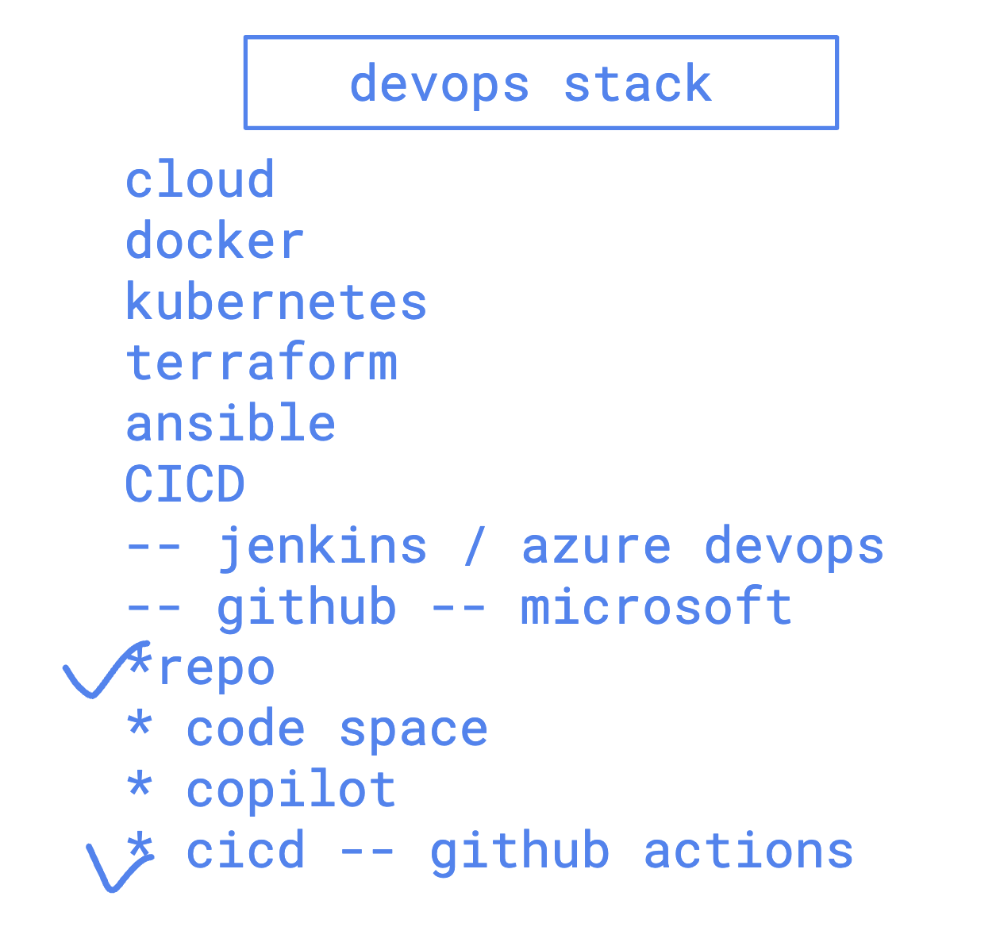
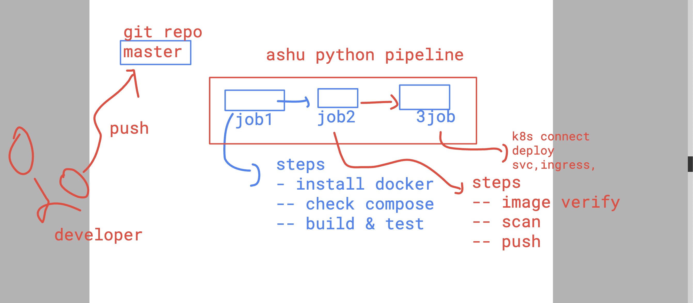
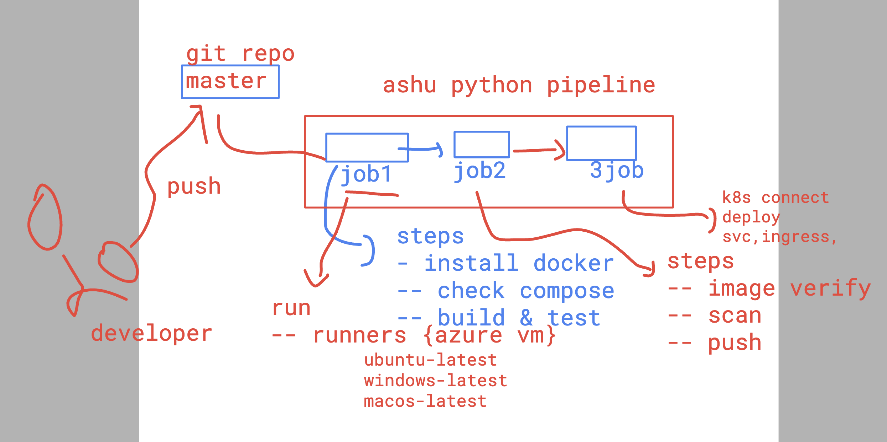

# devops_mastering 

## Notes 

### killercoda 
[click_to_access](https://killercoda.com/)

### kodeCloud 

[click_to_access](https://kodekloud.com/)

### Introduction to cicd using github actions 



### understanding pipeline jobs 



## creating github action pipeline workflow 

```
 humanfirmware@darwin  ~/devops_oracle_webapp   master  ls
Dockerfile       README.md        app.py           compose.yml      requirements.txt templates
 humanfirmware@darwin  ~/devops_oracle_webapp   master  mkdir .github
 humanfirmware@darwin  ~/devops_oracle_webapp   master  mkdir .github/workflows
 humanfirmware@darwin  ~/devops_oracle_webapp   master  ls .github 
workflows
 humanfirmware@darwin  ~/devops_oracle_webapp   master  ls .github/workflows 
python-ci.yml
 humanfirmware@darwin  ~/devops_oracle_webapp   master  


```

### by default github actions offer 3 runners {vm by azure}



### git commands
```
 git add .
 humanfirmware@darwin  ~/devops_oracle_webapp   master ✚  git commit -m "build and creating "
[master 1ccadc9] build and creating
 1 file changed, 8 insertions(+)
 humanfirmware@darwin  ~/devops_oracle_webapp  ↱ master  git push
Enumerating objects: 9, done.
Counting objects: 100% (9/9), done.
Delta compression using up to 8 threads
Compressing objects: 100% (3/3), done.
```


