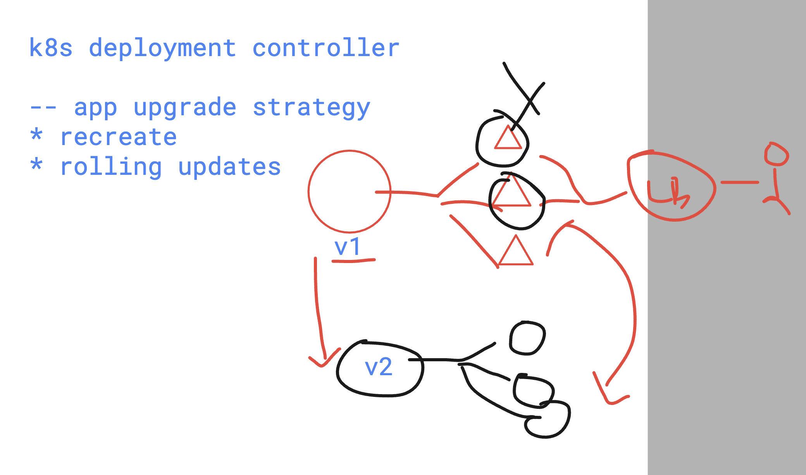

# devops_mastering 

## Notes 

### killercoda 
[click_to_access](https://killercoda.com/)

### kodeCloud 

[click_to_access](https://kodekloud.com/)

## Extending pipeline to deploy app in k8s 

### we can deploy our custom runners which can execute tasks 


### in windows runner if script execution is blocked in type in powershell as admin 

```
Set-ExecutionPolicy RemoteSigned
```

### deployment is using rolling updates



