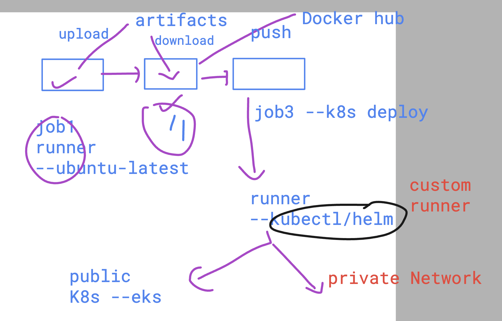

# devops_mastering 

## Notes 

### killercoda 
[click_to_access](https://killercoda.com/)

### kodeCloud 

[click_to_access](https://kodekloud.com/)

## Extending pipeline to deploy app in k8s 

### we can deploy our custom runners which can execute tasks 



### in windows runner if script execution is blocked in type in powershell as admin 

```
Set-ExecutionPolicy RemoteSigned
```

### deployment is using rolling updates


### history 

```
 13 kubectl.exe get  svc
  14 kubectl.exe  port-forward  svc/ashulb3  1244:80
  15 kubectl.exe get deploy
  16 kubectl.exe describe deploy ashu-web
  17 kubectl.exe  port-forward  svc/ashulb3  1244:80
  18 kubectl.exe  get  pods
  19 kubectl.exe  get  pods
  20 kubectl.exe  port-forward  svc/ashulb3  1244:80
  21 kubectl.exe  get deploy
  22 kubectl.exe  rollout
  23 kubectl.exe  rollout  history deploy ashu-web
  24 kubectl.exe  rollout  undo  deploy ashu-web
  25 kubectl.exe  rollout  status  deploy ashu-web
  26 kubectl.exe get pods
  27 kubectl.exe get pods
  28 kubectl.exe get pods
  29 kubectl.exe get pods


PS C:\Users\hp> kubectl.exe get pods
NAME                        READY   STATUS    RESTARTS   AGE
ashu-web-6747b7799c-4ppxt   1/1     Running   0          60s
ashu-web-6747b7799c-8ll9t   1/1     Running   0          58s
PS C:\Users\hp> kubectl.exe  port-forward  svc/ashulb3  1244:80
Forwarding from 127.0.0.1:1244 -> 5000
Forwarding from [::1]:1244 -> 5000
Handling connection for 1244
Handling connection for 1244
PS C:\Users\hp>  kubectl.exe  rollout  history deploy ashu-web
deployment.apps/ashu-web
REVISION  CHANGE-CAUSE
2         <none>
3         <none>

PS C:\Users\hp>
PS C:\Users\hp>
PS C:\Users\hp>
PS C:\Users\hp>
PS C:\Users\hp>
PS C:\Users\hp>
PS C:\Users\hp> kubectl.exe  describe deploy ashu-web
Name:                   ashu-web
Namespace:              default
CreationTimestamp:      Sat, 08 Jun 2024 05:42:41 -0700
Labels:                 app=ashu-web
Annotations:            deployment.kubernetes.io/revision: 3
Selector:               app=ashu-web
Replicas:               2 desired | 2 updated | 2 total | 2 available | 0 unavailable
StrategyType:           RollingUpdate
MinReadySeconds:        0
RollingUpdateStrategy:  25% max unavailable, 25% max surge
Pod Template:
  Labels:  app=ashu-web
  Containers:
   ashutestapp:
    Image:        dockerashu/ashutestapp:appvb7994eb1ace3b2823b6ee7c7fd8dcd7a18572bd8
    Port:         5000/TCP
    Host Port:    0/TCP
    Environment:  <none>
    Mounts:       <none>
  Volumes:        <none>
Conditions:
  Type           Status  Reason
  ----           ------  ------
  Available      True    MinimumReplicasAvailable
  Progressing    True    NewReplicaSetAvailable
OldReplicaSets:  ashu-web-7cd5fd86bd (0/0 replicas created)
NewReplicaSet:   ashu-web-6747b7799c (2/2 replicas created)
Events:
  Type    Reason             Age    From                   Message
  ----    ------             ----   ----                   -------
  Normal  ScalingReplicaSet  22m    deployment-controller  Scaled up replica set ashu-web-6747b7799c to 2
  Normal  ScalingReplicaSet  7m25s  deployment-controller  Scaled up replica set ashu-web-7cd5fd86bd to 1
  Normal  ScalingReplicaSet  6m52s  deployment-controller  Scaled down replica set ashu-web-6747b7799c to 1 from 2
  Normal  ScalingReplicaSet  6m52s  deployment-controller  Scaled up replica set ashu-web-7cd5fd86bd to 2 from 1
  Normal  ScalingReplicaSet  6m51s  deployment-controller  Scaled down replica set ashu-web-6747b7799c to 0 from 1
  Normal  ScalingReplicaSet  3m13s  deployment-controller  Scaled up replica set ashu-web-6747b7799c to 1 from 0
  Normal  ScalingReplicaSet  3m11s  deployment-controller  Scaled down replica set ashu-web-7cd5fd86bd to 1 from 2
  Normal  ScalingReplicaSet  3m11s  deployment-controller  Scaled up replica set ashu-web-6747b7799c to 2 from 1
  Normal  ScalingReplicaSet  3m10s  deployment-controller  Scaled down replica set ashu-web-7cd5fd86bd to 0 from 1
PS C:\Users\hp>
```
