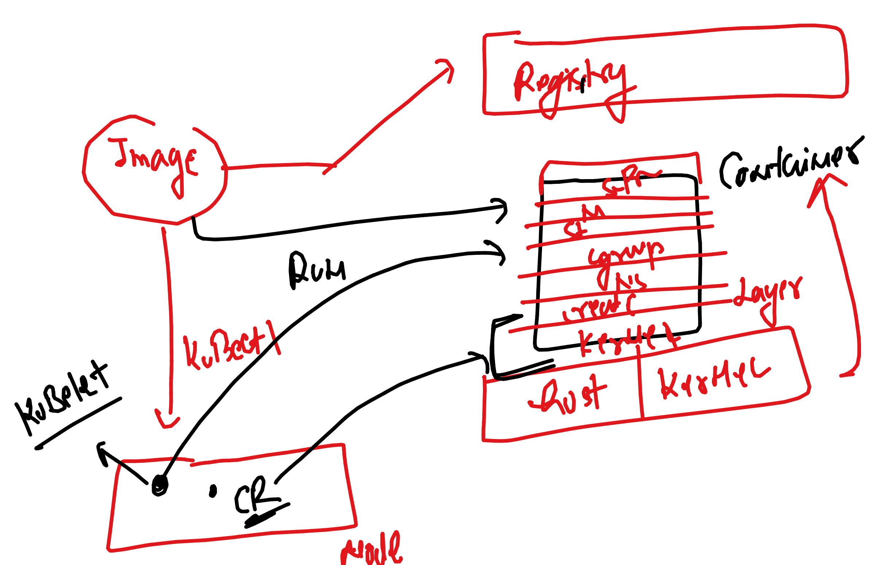
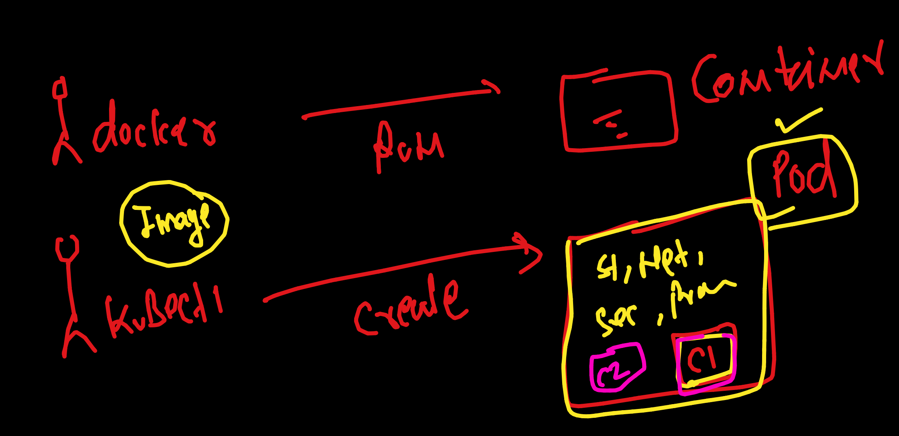

# devops_mastering

### deploying app in K8s 


### introduction to Pod 



## To create Pod there are certain things 

### checking kubectl version 

```
 kubectl  version --client  
Client Version: v1.29.1
Kustomize Version: v5.0.4-0.20230601165947-6ce0bf390ce3
```

### checking control plane connection 

```
 k8s git:(master) ✗ kubectl  version                             
Client Version: v1.29.1
Kustomize Version: v5.0.4-0.20230601165947-6ce0bf390ce3
Server Version: v1.29.3+k3s1
➜  k8s git:(master) ✗ 
➜  k8s git:(master) ✗ kubectl  get nodes
NAME                   STATUS   ROLES                  AGE   VERSION
lima-rancher-desktop   Ready    control-plane,master   23h   v1.29.3+k3s1
➜  k8s git:(master) ✗ 
➜  k8s git:(master) ✗ kubectl  get  pods
No resources found in default namespace.
➜  k8s git:(master) ✗ 


```

### Creating POd using yaml 

```
apiVersion: v1 
kind: Pod # we want to create pod 
metadata:
  name: ashupod1  # name of Kind 
spec: 
  containers:
  - image: nginx 
    name: ashuc1 
  # - name: ashuc1 
  #   image: nginx 


```

### creating it 

```
k8s git:(master) ✗ ls
README.md day1      day2      day3
➜  k8s git:(master) ✗ cd day3 
➜  day3 git:(master) ✗ ls
README.md     ashupod1.yaml
➜  day3 git:(master) ✗ kubectl   create  -f ashupod1.yaml 
pod/ashupod1 created
➜  day3 git:(master) ✗ kubectl  get  pods
NAME       READY   STATUS              RESTARTS   AGE
ashupod1   0/1     ContainerCreating   0          33s
➜  day3 git:(master) ✗ kubectl  get  pods
NAME       READY   STATUS    RESTARTS   AGE
ashupod1   1/1     Running   0          55s
```

### we can check logs of container inside pod 

```
day3 git:(master) ✗ kubectl  logs  ashupod1 
/docker-entrypoint.sh: /docker-entrypoint.d/ is not empty, will attempt to perform configuration
/docker-entrypoint.sh: Looking for shell scripts in /docker-entrypoint.d/
/docker-entrypoint.sh: Launching /docker-entrypoint.d/10-listen-on-ipv6-by-default.sh
10-listen-on-ipv6-by-default.sh: info: Getting the checksum of /etc/nginx/conf.d/default.conf
10-listen-on-ipv6-by-default.sh: info: Enabled listen on IPv6 in /etc/nginx/conf.d/
```

### using describe for pod 

```
kubectl  describe  pod  ashupod1 
Name:             ashupod1
Namespace:        default
Priority:         0
Service Account:  default
Node:             lima-rancher-desktop/192.168.5.15
Start Time:       Wed, 17 Apr 2024 19:43:39 +0530
Labels:           <none>
Annotations:      <none>
Status:           Running
IP:               10.42.0.14
IPs:
  IP:  10.42.0.14
Containers:
  ashuc1:
    Container ID:   docker://de62a678afeb04c7fb008b63d7c863ed8da2652258383afa5d09925be11facc1
    Image:          nginx
```

### accessing container inside pod 

```
 kubectl  get  pods
NAME       READY   STATUS    RESTARTS   AGE
ashupod1   1/1     Running   0          4m18s
➜  day3 git:(master) ✗ 
➜  day3 git:(master) ✗ kubectl  exec  -it  ashupod1  -- bash 
root@ashupod1:/# 
root@ashupod1:/# 
root@ashupod1:/# id
uid=0(root) gid=0(root) groups=0(root)
root@ashupod1:/# cat  /etc/os-release 
PRETTY_NAME="Debian GNU/Linux 12 (bookworm)"
NAME="Debian GNU/Linux"
VERSION_ID="12"
VERSION="12 (bookworm)"
VERSION_CODENAME=bookworm
ID=debian
HOME_URL="https://www.debian.org/"
SUPPORT_URL="https://www.debian.org/support"
BUG_REPORT_URL="https://bugs.debian.org/"
root@ashupod1:/# exit 
exit
```

## Deleting pod

```
 kubectl  delete  -f ashupod1.yaml 
pod "ashupod1" deleted
➜  day3 git:(master) ✗ kubectl get po
No resources found in default namespace.
➜  day3 git:(master) ✗ 

```
### delete pod 

```
day3 git:(master) ✗ kubectl get po 
NAME       READY   STATUS              RESTARTS   AGE
ashupod1   0/1     ContainerCreating   0          4s
➜  day3 git:(master) ✗ 
➜  day3 git:(master) ✗ kubectl  delete  pod  ashupod1 
pod "ashupod1" deleted
➜  day3 git:(master) ✗ 
```

### having multiple container in pod 

```
 kubectl create -f ashupod1.yaml 
pod/ashupod1 created
➜  day3 git:(master) ✗ kubectl  get  pods
NAME       READY   STATUS              RESTARTS   AGE
ashupod1   0/2     ContainerCreating   0          4s
➜  day3 git:(master) ✗ kubectl  get  pods
NAME       READY   STATUS    RESTARTS   AGE
ashupod1   2/2     Running   0          30s
➜  day3 git:(master) ✗ kubectl  exec -it  ashupod1 -- bash 
Defaulted container "ashuc1" out of: ashuc1, ashuc2
root@ashupod1:/# exit
exit
➜  day3 git:(master) ✗ kubectl  exec -it  ashupod1 -c ashuc2    -- sh   
/ # id
uid=0(root) gid=0(root) groups=0(root),1(bin),2(daemon),3(sys),4(adm),6(disk),10(wheel),11(floppy),20(dialout),26(tape),27(video)
/ # exit
➜  day3 git:(master) ✗ 
```


