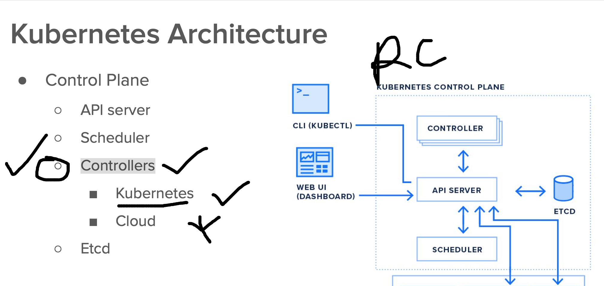

# devops_mastering
## auto generate yaml/json file for pod 

```
kubectl  run ashupod1 --image=nginx  --dry-run=client  -o yaml 
apiVersion: v1
kind: Pod
metadata:
  creationTimestamp: null
  labels:
    run: ashupod1
  name: ashupod1
spec:
  containers:
  - image: nginx
    name: ashupod1
    resources: {}
  dnsPolicy: ClusterFirst
  restartPolicy: Always
status: {}
```
### in Json format

```
kubectl  run ashupod1 --image=nginx  --dry-run=client  -o json 
```

### creating json file also 

```
kubectl create -f ashupod1.json 
pod/ashupod1 created
➜  ashu-k8s-manifest git:(master) ✗ kubectl get pods
NAME       READY   STATUS              RESTARTS   AGE
ashupod1   0/1     ContainerCreating   0          3s
➜  ashu-k8s-manifest git:(master) ✗ 
```

### problem 

```
  i)   self healing  -- recreate if got destroyed 
  ii)  horizontally scale -- making more pods parallel
 iii) roll back  --- if upgraded then we can not go back 

```

### Solving first 2 problems using replication Controller 



### RC creating manifest 

```
apiVersion: v1
kind: ReplicationController 
metadata:
  labels:
    new: ashurc4545
  name: ashurc2     
spec: 
  replicas: 1
  selector: # for finding 
    x: helloashu
    z: dev 
  template: # RC will be using Template to create Pods 
    metadata:
      labels: # this is label of pods during creation 
        x: helloashu  
        z: dev  
    spec: 
      containers:
      - image: nginx 
        name: ashuc1 
```

### creating rc 

```

➜  ashu-k8s-manifest git:(master) ✗ kubectl  create -f  ashurc1.yaml 
replicationcontroller/ashurc2 created

➜  ashu-k8s-manifest git:(master) ✗ kubectl get rc
NAME      DESIRED   CURRENT   READY   AGE
ashurc2   1         1         0       3s
➜  ashu-k8s-manifest git:(master) ✗ 
```
### how to check lable of pods

```
 ashu-k8s-manifest git:(master) ✗ kubectl get po
NAME            READY   STATUS    RESTARTS   AGE
ashurc2-xxg6r   1/1     Running   0          28s
➜  ashu-k8s-manifest git:(master) ✗ kubectl get po --show-labels
NAME            READY   STATUS    RESTARTS   AGE   LABELS
ashurc2-xxg6r   1/1     Running   0          33s   x=helloashu,z=dev
➜  ashu-k8s-manifest git:(master) 
```

### how to check pod schedule nodes

```
kubectl get po -o wide
NAME            READY   STATUS    RESTARTS   AGE   IP           NODE                   NOMINATED NODE   READINESS GATES
ashurc2-xxg6r   1/1     Running   0          55s   10.42.0.28   lima-rancher-desktop   <none>           <none>
➜  ashu-k8s-manifest git:(master) ✗ 


```

### how to find pod using lables 

```
  ashu-k8s-manifest git:(master) ✗ kubectl get po --show-labels        
NAME            READY   STATUS              RESTARTS   AGE   LABELS
ashurc2-xxg6r   1/1     Running             0          95s   x=helloashu,z=dev
ashupod6        0/1     ContainerCreating   0          3s    run=ashupod6
➜  ashu-k8s-manifest git:(master) ✗ 

➜  ashu-k8s-manifest git:(master) ✗ kubectl get po --selector x=helloashu
NAME            READY   STATUS    RESTARTS   AGE
ashurc2-xxg6r   1/1     Running   0          104s
➜  ashu-k8s-manifest git:(master) ✗ 

```

### we can scale pod -- by change in rc file then apply it 

```
 kubectl  apply -f ashurc1.yaml 
Warning: resource replicationcontrollers/ashurc2 is missing the kubectl.kubernetes.io/last-applied-configuration annotation which is required by kubectl apply. kubectl apply should only be used on resources created declaratively by either kubectl create --save-config or kubectl apply. The missing annotation will be patched automatically.
replicationcontroller/ashurc2 configured
➜  ashu-k8s-manifest git:(master) ✗ 
➜  ashu-k8s-manifest git:(master) ✗ kubectl  get rc                
NAME      DESIRED   CURRENT   READY   AGE
ashurc2   2         2         1       2m56s
➜  ashu-k8s-manifest git:(master) ✗ kubectl  get  po
NAME            READY   STATUS              RESTARTS   AGE
ashurc2-xxg6r   1/1     Running             0          3m2s
ashupod6        1/1     Running             0          90s
ashurc2-zjvlt   0/1     ContainerCreating   0          9s
➜  ashu-k8s-manifest git:(master) ✗ kubectl  get  po --show-labels
NAME            READY   STATUS    RESTARTS   AGE     LABELS
ashurc2-xxg6r   1/1     Running   0          3m18s   x=helloashu,z=dev
ashupod6        1/1     Running   0          106s    run=ashupod6
ashurc2-zjvlt   1/1     Running   0          25s     x=helloashu,z=dev
```

### we can also scale pod without using RC file 

```
 kubectl  get  rc
NAME      DESIRED   CURRENT   READY   AGE
ashurc2   1         1         1       4m5s
➜  ashu-k8s-manifest git:(master) ✗ kubectl  scale  rc  ashurc2  --replicas=3
replicationcontroller/ashurc2 scaled
➜  ashu-k8s-manifest git:(master) ✗ kubectl  get  rc                         
NAME      DESIRED   CURRENT   READY   AGE
ashurc2   3         3         1       4m36s
➜  ashu-k8s-manifest git:(master) ✗ kubectl  get  po
NAME            READY   STATUS              RESTARTS   AGE
ashurc2-xxg6r   1/1     Running             0          4m45s
ashupod6        1/1     Running             0          3m13s
ashurc2-gsrml   0/1     ContainerCreating   0          11s
ashurc2-98fbn   0/1     ContainerCreating   0          11s
```
