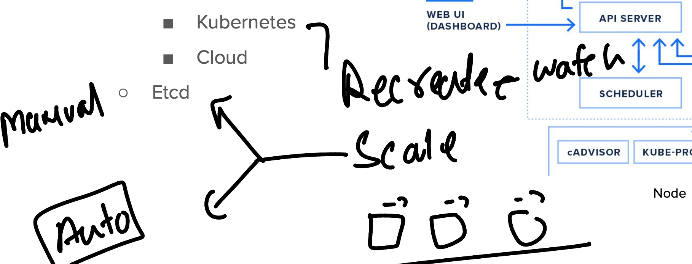

# devops_mastering

### purpose of multi container in pod 


## Horizontal scaling concept of pod using RC 



### more commands on RC 

```
kubectl get rc
NAME      DESIRED   CURRENT   READY   AGE
ashurc2   1         1         1       3m54s
➜  ashu-k8s-manifest git:(master) ✗ kubectl scale rc  ashurc2  --replicas=2
replicationcontroller/ashurc2 scaled
➜  ashu-k8s-manifest git:(master) ✗ kubectl get rc                         
NAME      DESIRED   CURRENT   READY   AGE
ashurc2   2         2         1       4m8s
➜  ashu-k8s-manifest git:(master) ✗ kubectl get rc
NAME      DESIRED   CURRENT   READY   AGE
ashurc2   2         2         2       4m21s
➜  ashu-k8s-manifest git:(master) ✗ kubectl get  po
NAME            READY   STATUS    RESTARTS   AGE
ashurc2-fvsqj   1/1     Running   0          3m52s
ashurc2-t2tfs   1/1     Running   0          22s
➜  ashu-k8s-manifest git:(master) ✗ kubectl get  po --show-labels
NAME            READY   STATUS    RESTARTS   AGE     LABELS
ashurc2-fvsqj   1/1     Running   0          3m56s   x=helloashu,z=dev
ashurc2-t2tfs   1/1     Running   0          26s     x=helloashu,z=dev
➜  ashu-k8s-manifest git:(master) ✗ kubectl  delete pods ashurc2-t2tfs
pod "ashurc2-t2tfs" deleted
➜  ashu-k8s-manifest git:(master) ✗ kubectl get  po --show-labels     
NAME            READY   STATUS              RESTARTS   AGE    LABELS
ashurc2-fvsqj   1/1     Running             0          4m9s   x=helloashu,z=dev
ashurc2-lbx2g   0/1     ContainerCreating   0          5s     x=helloashu,z=dev
```

## RC & RS has a common problem 


### Solution using deployment controller 


### reality of Deployment controller 


### Apiversion release and resources in k8s control plane 


### checking api_version and release 

```
kubectl  api-resources 
NAME                              SHORTNAMES   APIVERSION                        NAMESPACED   KIND
bindings                                       v1                                true         Binding
componentstatuses                 cs           v1                                false        ComponentStatus
configmaps                        cm           v1                                true         ConfigMap

```

### Creating manifest file of deployment controller 

```
kubectl  create  deployment  ashu-dep1  --image=nginx  --port 80  --dry-run=client  -o yaml 
apiVersion: apps/v1
kind: Deployment
metadata:
  creationTimestamp: null
  labels:

```

### more command in controllers 

```
 ashu-k8s-manifest git:(master) ✗ kubectl  get  po
NAME                          READY   STATUS              RESTARTS   AGE
ashu-dep1-9c8b4d864-tw7ht     1/1     Running             0          3m49s
ashurc2-t6qmh                 1/1     Running             0          2m55s
wehfskfjsfg-6fb88f6fb-8xtl7   0/1     ContainerCreating   0          8s
➜  ashu-k8s-manifest git:(master) ✗ 
➜  ashu-k8s-manifest git:(master) ✗ 
➜  ashu-k8s-manifest git:(master) ✗ kubectl   get   rc,deploy
NAME                            DESIRED   CURRENT   READY   AGE
replicationcontroller/ashurc2   1         1         1       3m30s

NAME                          READY   UP-TO-DATE   AVAILABLE   AGE
deployment.apps/ashu-dep1     1/1     1            1           4m24s
deployment.apps/wehfskfjsfg   1/1     1            1           43s
➜  ashu-k8s-manifest git:(master) ✗ kubectl delete rc ashurc2  
replicationcontroller "ashurc2" deleted
➜  ashu-k8s-manifest git:(master) ✗ kubectl  get po
NAME                          READY   STATUS    RESTARTS   AGE
ashu-dep1-9c8b4d864-tw7ht     1/1     Running   0          5m38s
wehfskfjsfg-6fb88f6fb-8xtl7   1/1     Running   0          117s
➜  ashu-k8s-manifest git:(master) ✗ kubectl delete all --all
pod "ashu-dep1-9c8b4d864-tw7ht" deleted
pod "wehfskfjsfg-6fb88f6fb-8xtl7" deleted
service "kubernetes" deleted
deployment.apps "ashu-dep1" deleted
deployment.apps "wehfskfjsfg" deleted
replicaset.apps "ashu-dep1-9c8b4d864" deleted
➜  ashu-k8s-manifest git:(master) ✗ 


```

### real Deployment controller with hierarchy 

```
ashu-k8s-manifest git:(master) ✗ kubectl  create -f deploy1.yaml 
deployment.apps/ashu-dep1 created
➜  ashu-k8s-manifest git:(master) ✗ 
➜  ashu-k8s-manifest git:(master) ✗ kubectl  get  deploy
NAME        READY   UP-TO-DATE   AVAILABLE   AGE
ashu-dep1   0/1     1            0           4s
➜  ashu-k8s-manifest git:(master) ✗ kubectl  get  rs    
NAME                  DESIRED   CURRENT   READY   AGE
ashu-dep1-9c8b4d864   1         1         0       7s
➜  ashu-k8s-manifest git:(master) ✗ kubectl  get  po
NAME                        READY   STATUS              RESTARTS   AGE
ashu-dep1-9c8b4d864-tmfg6   0/1     ContainerCreating   0          9s
➜  ashu-k8s-manifest git:(master) ✗ 
```

## manual scaling of Deployment | rs | rc will be same 

```
ashu-k8s-manifest git:(master) ✗ kubectl get deploy
NAME        READY   UP-TO-DATE   AVAILABLE   AGE
ashu-dep1   1/1     1            1           60s
➜  ashu-k8s-manifest git:(master) ✗ 
➜  ashu-k8s-manifest git:(master) ✗ kubectl  scale deployment  ashu-dep1   --replicas=3
deployment.apps/ashu-dep1 scaled
➜  ashu-k8s-manifest git:(master) ✗ kubectl get deploy                                 
NAME        READY   UP-TO-DATE   AVAILABLE   AGE
ashu-dep1   3/3     3            3           91s
➜  ashu-k8s-manifest git:(master) ✗ kubectl get po    
NAME                        READY   STATUS    RESTARTS   AGE
ashu-dep1-9c8b4d864-tmfg6   1/1     Running   0          95s
ashu-dep1-9c8b4d864-kz2pf   1/1     Running   0          17s
ashu-dep1-9c8b4d864-k26tf   1/1     Running   0          17s
➜  ashu-k8s-manifest git:(master) ✗ 
```

