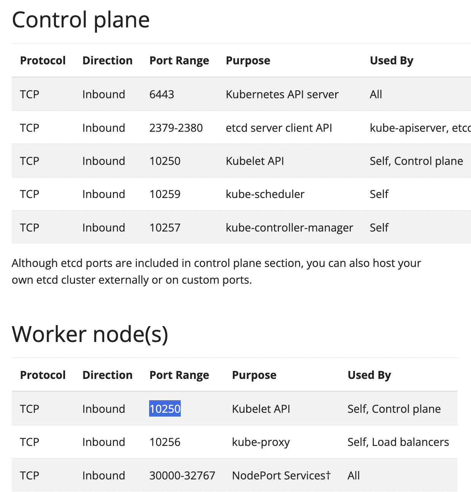
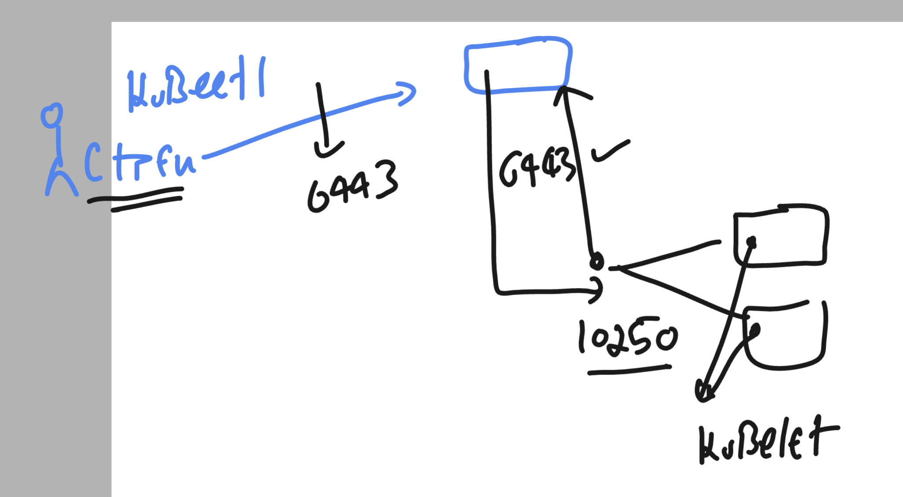
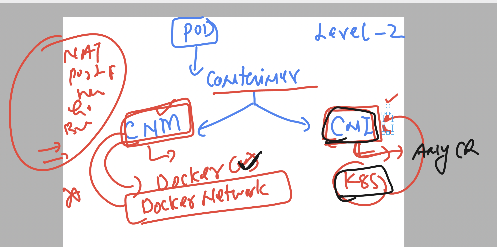

# devops_mastering --- day7  

### taking help from k8s 

```
10214  kubectl  explain  pod
10215  kubectl  explain  pod.metadata
10216  kubectl  explain  pod.spec 
10217  kubectl  explain  pod.spec.containers 
10218  kubectl  explain  Deployment 
10219  kubectl  explain  Deployment.spec 

```

### k8s control plane & data plane ports 



### client and dataplane nodes will connect on apiServer



### container networking is done by 




