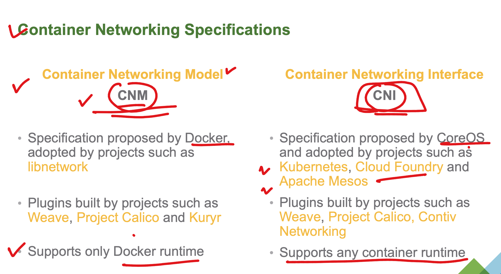
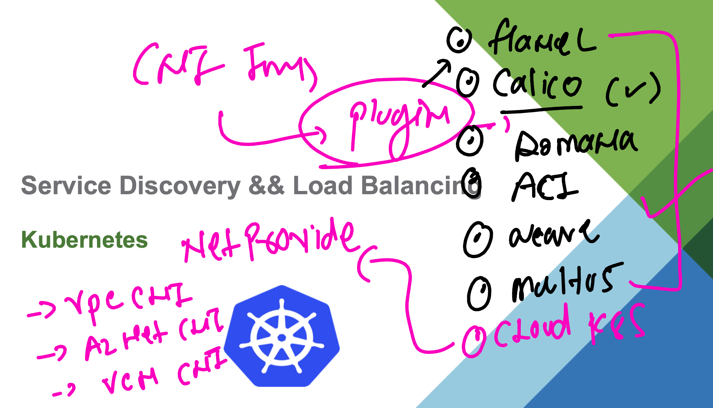
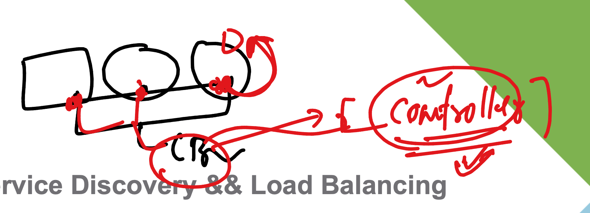

# devops_mastering --- Day8 

### Container Networking 

### Every k8s will have a default CNI Distributed Virtual bridge 

### CNI plugins 

[click_here](https://github.com/containernetworking/cni)

### More on CNI 

