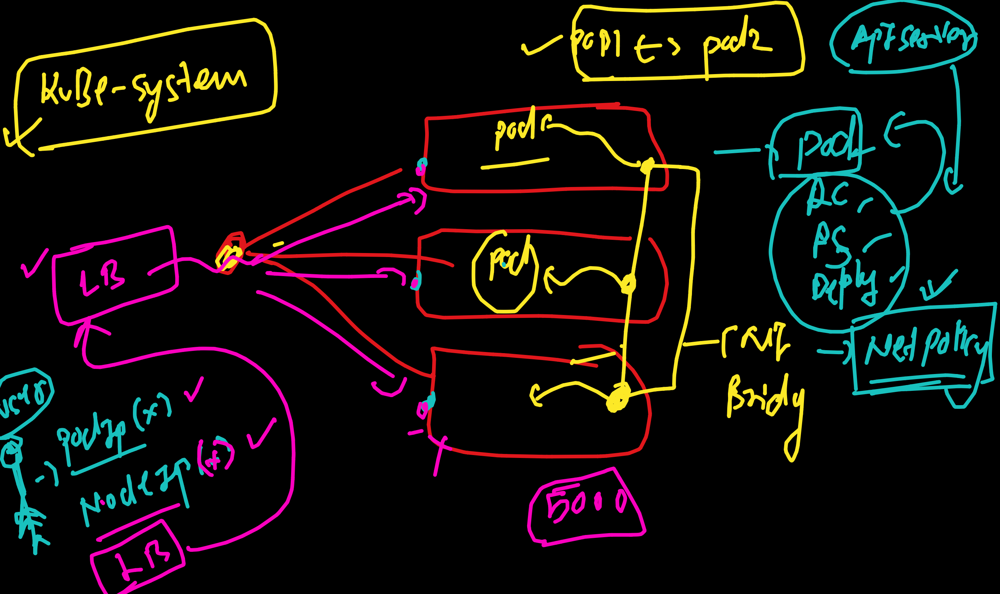
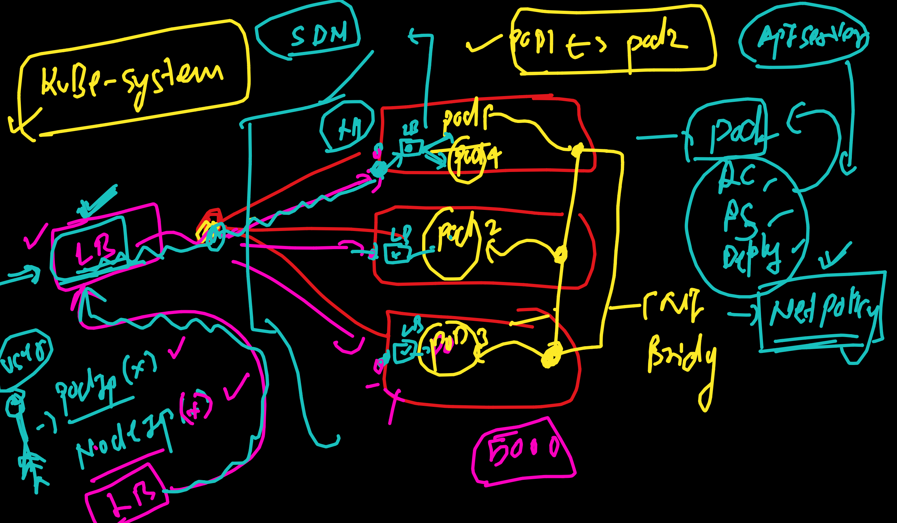

# devops_mastering--day9

### Replacing CMD & ENtrypoint in K8s 


### using args in k8s to replace docker image process maintained by CMD in Dockerfile

```
kubectl  run ashupod1 --image=alpine  sleep 5000 --dry-run=client -o yaml                 
apiVersion: v1
kind: Pod
metadata:
  creationTimestamp: null
  labels:
    run: ashupod1
  name: ashupod1
spec:
  containers:
  - args:
    - sleep
    - "5000"
    image: alpine
    name: ashupod1
    resources: {}
  dnsPolicy: ClusterFirst
  restartPolicy: Always
```

### if dockerfile maintainer default process by Entrypoint then in k8s we can replace using command

```
 ashu-k8s-manifest git:(master) ✗ kubectl  run ashupod1 --image=alpine  --command sleep 5000 --dry-run=client -o yaml   
apiVersion: v1
kind: Pod
metadata:
  creationTimestamp: null
  labels:
    run: ashupod1
  name: ashupod1
spec:
  containers:
  - command:
    - sleep
    - "5000"
    image: alpine
    name: ashupod1
    resources: {}
  dnsPolicy: ClusterFirst
  restartPolicy: Always
status: {}
➜  ashu-k8s-manifest git:(master) ✗ 
```

### multiple pod can connect to each other even if they are in different nodes 

```
 ashu-k8s-manifest git:(master) ✗ kubectl  get po -o wide
NAME                        READY   STATUS    RESTARTS   AGE    IP           NODE                   NOMINATED NODE   READINESS GATES
ashu-dep1-9c8b4d864-tmfg6   1/1     Running   0          5d7h   10.42.0.40   lima-rancher-desktop   <none>           <none>
ashupod1                    1/1     Running   0          10m    10.42.0.43   lima-rancher-desktop   <none>           <none>
➜  ashu-k8s-manifest git:(master) ✗ 
➜  ashu-k8s-manifest git:(master) ✗ 
➜  ashu-k8s-manifest git:(master) ✗ kubectl  exec -it ashupod1  -- sh 
/ # ifconfig 
eth0      Link encap:Ethernet  HWaddr C2:96:75:5C:4E:B9  
          inet addr:10.42.0.43  Bcast:10.42.0.255  Mask:255.255.255.0
          UP BROADCAST RUNNING MULTICAST  MTU:1450  Metric:1
          RX packets:5 errors:0 dropped:0 overruns:0 frame:0
          TX packets:1 errors:0 dropped:0 overruns:0 carrier:0
          collisions:0 txqueuelen:0 
          RX bytes:446 (446.0 B)  TX bytes:42 (42.0 B)

lo        Link encap:Local Loopback  
          inet addr:127.0.0.1  Mask:255.0.0.0
          UP LOOPBACK RUNNING  MTU:65536  Metric:1
          RX packets:0 errors:0 dropped:0 overruns:0 frame:0
          TX packets:0 errors:0 dropped:0 overruns:0 carrier:0
          collisions:0 txqueuelen:1000 
          RX bytes:0 (0.0 B)  TX bytes:0 (0.0 B)

/ # ping  10.42.0.40
PING 10.42.0.40 (10.42.0.40): 56 data bytes
64 bytes from 10.42.0.40: seq=0 ttl=64 time=0.908 ms
64 bytes from 10.42.0.40: seq=1 ttl=64 time=0.043 ms
^C
--- 10.42.0.40 ping statistics ---
2 packets transmitted, 2 packets received, 0% packet loss
round-trip min/avg/max = 0.043/0.475/0.908 ms
/ # exit
```

# LoadBalancer -- >> 
### External User will be using LoadBalancer to access apps running in pod 



### K8s -- need Internal LB also to balance traffic among pods



### More info about LB internal 


